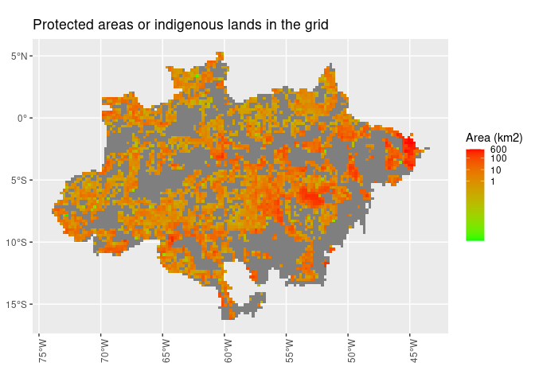

<!-- README.md is generated from README.Rmd. Please edit that file -->

# prioritizedeforestationhotspots

<!-- badges: start -->

[](https://github.com/albhasan/prioritizedeforestationhotspots/actions/workflows/R-CMD-check.yaml)
<!-- badges: end -->

This package introduces a method for prioritizing deforestation hotspots
to support law enforcement actions in the Brazilian Amazon, as describen
in the paper entitled: *Science-based planning can support law
enforcement actions to curb deforestation in the Brazilian Amazon* by
Mataveli et at. (2022) \[1\], available at
<https://doi.org/10.1111/conl.12908>

This is the abstract of the aforementioned paper \[1\]:

While Brazil publicly committed to reduce deforestation in Amazonia at
the 26th Conference of the Parties (COP26), the Brazilian parliament is
moving toward weakening environmental laws. Deforestation rates continue
ascending, reaching in 2021 the highest value since 2006 (13,235 km2).
To overcome this paradox, strategies to curb deforestation are
mandatory. The current strategy, “Plano Amazônia 21/22,” prioritizes law
enforcement actions to curb illegal deforestation in only 11 Amazonian
municipalities. Here, we show that this prioritization is likely to be
insufficient since these municipalities account for just 37% of the
current deforestation rate. This strategy may also be undermined by the
leakage of deforestation actions to unmonitored municipalities. Using a
set of spatially explicit datasets integrated into a
deforestation-prediction modeling approach, we propose a science-based
alternative method for ranking deforestation hotspots to be prioritized
by law enforcement actions. Our prioritization method accounts for more
than 60% of the deforestation, detecting larger deforested areas in both
private and public lands, while covering 27% less territory than “Plano
Amazônia 21/22.” Optimizing the detection of priority areas for curbing
deforestation, as proposed here, is the first step to reducing
deforestation rates and comply with the Brazilian legal commitment of
3925 km2 year−1.

\[1\] Mataveli, G., de Oliveira, G., Chaves, M. E., Dalagnol, R.,
Wagner, F. H., Ipia, A. H., … & Aragão, L. E. (2022). Science‐based
planning can support law enforcement actions to curb deforestation in
the Brazilian Amazon. Conservation Letters, e12908.

## Installation

You can install the development version of
prioritizedeforestationhotspots from [GitHub](https://github.com/) with:

``` r
# install.packages("devtools")
devtools::install_github("albhasan/prioritizedeforestationhotspots")
```

## Example

This basic example produces results similar to those shown in the
aforementioned paper:

``` r
library(prioritizedeforestationhotspots)

## Run the model
## NOTE: This can take long!
# out_dir <- "~/Documents/prioritize_res"
# estimate_accuracy(out_dir)
# fit_model(out_dir)
```

This example shows the resulting deforestation hotspots.

``` r
library(prioritizedeforestationhotspots)
library(dplyr)
#> 
#> Attaching package: 'dplyr'
#> The following objects are masked from 'package:stats':
#> 
#>     filter, lag
#> The following objects are masked from 'package:base':
#> 
#>     intersect, setdiff, setequal, union
library(geobr)
#> Loading required namespace: sf
library(ggplot2)
library(purrr)
library(sf)
#> Linking to GEOS 3.11.0, GDAL 3.5.2, PROJ 9.0.1; sf_use_s2() is TRUE
library(tidyr)
library(tools)

# Build a tibble with the paths to the results.
results_tb <- 
    system.file("extdata", "results", 
            package = "prioritizedeforestationhotspots") %>%
    list.files(pattern = "*.shp$", 
               full.names = TRUE) %>%
    as_tibble() %>%
    rename(file_path = value) %>%
    mutate(
        file_name = file_path_sans_ext(basename(file_path))
    ) %>%
    separate_wider_delim(file_name, 
                                delim ="_", 
                                names = c(NA, NA, "ref_year")) %>%
    mutate(vector_data = map2(file_path, ref_year,
        function(f, y) {
            f %>%
                read_sf() %>%
                mutate(ref_year = y) %>%
                return()
        })
    )

# Merge the results of different reference years into a single sf object.
results <- do.call(rbind, results_tb[["vector_data"]])

# Build a map.
results %>%
    ggplot() +
    #geom_sf(data = geobr::read_amazon()) +
    geom_sf(data = filter(geobr::read_biomes(), name_biome == "Amazônia")) +
    geom_sf(aes(color = ref_year)) +
    facet_wrap(~ref_year) +
    theme(axis.text.x = element_text(angle = 90)) +
    theme(legend.title=element_blank()) +
    ggtitle("Priority areas (deforestation hotspots)") 
#> Using year 2019
#> Downloading: 770 B     Downloading: 770 B     Downloading: 1.6 kB     Downloading: 1.6 kB     Downloading: 1.8 kB     Downloading: 1.8 kB     Downloading: 1.9 kB     Downloading: 1.9 kB     Downloading: 1.9 kB     Downloading: 1.9 kB     Downloading: 1.9 kB     Downloading: 1.9 kB     Downloading: 1.9 kB     Downloading: 1.9 kB     Downloading: 10 kB     Downloading: 10 kB     Downloading: 10 kB     Downloading: 10 kB     Downloading: 10 kB     Downloading: 10 kB     Downloading: 10 kB     Downloading: 10 kB     Downloading: 18 kB     Downloading: 18 kB     Downloading: 18 kB     Downloading: 18 kB     Downloading: 18 kB     Downloading: 18 kB     Downloading: 18 kB     Downloading: 18 kB     Downloading: 18 kB     Downloading: 18 kB     Downloading: 26 kB     Downloading: 26 kB     Downloading: 26 kB     Downloading: 26 kB     Downloading: 26 kB     Downloading: 26 kB     Downloading: 26 kB     Downloading: 26 kB     Downloading: 26 kB     Downloading: 26 kB     Downloading: 26 kB     Downloading: 26 kB     Downloading: 34 kB     Downloading: 34 kB     Downloading: 34 kB     Downloading: 34 kB     Downloading: 34 kB     Downloading: 34 kB     Downloading: 34 kB     Downloading: 34 kB     Downloading: 34 kB     Downloading: 34 kB     Downloading: 34 kB     Downloading: 34 kB     Downloading: 42 kB     Downloading: 42 kB     Downloading: 42 kB     Downloading: 42 kB     Downloading: 42 kB     Downloading: 42 kB     Downloading: 42 kB     Downloading: 42 kB     Downloading: 42 kB     Downloading: 42 kB     Downloading: 42 kB     Downloading: 42 kB     Downloading: 51 kB     Downloading: 51 kB     Downloading: 51 kB     Downloading: 51 kB     Downloading: 51 kB     Downloading: 51 kB     Downloading: 51 kB     Downloading: 51 kB     Downloading: 51 kB     Downloading: 51 kB     Downloading: 59 kB     Downloading: 59 kB     Downloading: 59 kB     Downloading: 59 kB     Downloading: 59 kB     Downloading: 59 kB     Downloading: 59 kB     Downloading: 59 kB     Downloading: 67 kB     Downloading: 67 kB     Downloading: 67 kB     Downloading: 67 kB     Downloading: 67 kB     Downloading: 67 kB     Downloading: 67 kB     Downloading: 67 kB     Downloading: 67 kB     Downloading: 67 kB     Downloading: 67 kB     Downloading: 67 kB     Downloading: 75 kB     Downloading: 75 kB     Downloading: 75 kB     Downloading: 75 kB     Downloading: 75 kB     Downloading: 75 kB     Downloading: 75 kB     Downloading: 75 kB     Downloading: 75 kB     Downloading: 75 kB     Downloading: 75 kB     Downloading: 75 kB     Downloading: 83 kB     Downloading: 83 kB     Downloading: 83 kB     Downloading: 83 kB     Downloading: 83 kB     Downloading: 83 kB     Downloading: 83 kB     Downloading: 83 kB     Downloading: 83 kB     Downloading: 83 kB     Downloading: 83 kB     Downloading: 83 kB     Downloading: 91 kB     Downloading: 91 kB     Downloading: 91 kB     Downloading: 91 kB     Downloading: 91 kB     Downloading: 91 kB     Downloading: 91 kB     Downloading: 91 kB     Downloading: 99 kB     Downloading: 99 kB     Downloading: 99 kB     Downloading: 99 kB     Downloading: 99 kB     Downloading: 99 kB     Downloading: 99 kB     Downloading: 99 kB     Downloading: 110 kB     Downloading: 110 kB     Downloading: 110 kB     Downloading: 110 kB     Downloading: 110 kB     Downloading: 110 kB     Downloading: 110 kB     Downloading: 110 kB     Downloading: 110 kB     Downloading: 110 kB     Downloading: 120 kB     Downloading: 120 kB     Downloading: 120 kB     Downloading: 120 kB     Downloading: 120 kB     Downloading: 120 kB     Downloading: 120 kB     Downloading: 120 kB     Downloading: 120 kB     Downloading: 120 kB     Downloading: 120 kB     Downloading: 120 kB     Downloading: 120 kB     Downloading: 120 kB     Downloading: 120 kB     Downloading: 120 kB     Downloading: 120 kB     Downloading: 120 kB     Downloading: 130 kB     Downloading: 130 kB     Downloading: 130 kB     Downloading: 130 kB     Downloading: 130 kB     Downloading: 130 kB     Downloading: 130 kB     Downloading: 130 kB     Downloading: 130 kB     Downloading: 130 kB     Downloading: 140 kB     Downloading: 140 kB     Downloading: 140 kB     Downloading: 140 kB     Downloading: 140 kB     Downloading: 140 kB     Downloading: 140 kB     Downloading: 140 kB     Downloading: 140 kB     Downloading: 140 kB     Downloading: 150 kB     Downloading: 150 kB     Downloading: 150 kB     Downloading: 150 kB     Downloading: 150 kB     Downloading: 150 kB     Downloading: 150 kB     Downloading: 150 kB     Downloading: 150 kB     Downloading: 150 kB     Downloading: 150 kB     Downloading: 150 kB     Downloading: 160 kB     Downloading: 160 kB     Downloading: 160 kB     Downloading: 160 kB     Downloading: 160 kB     Downloading: 160 kB     Downloading: 160 kB     Downloading: 160 kB     Downloading: 160 kB     Downloading: 160 kB     Downloading: 160 kB     Downloading: 160 kB     Downloading: 160 kB     Downloading: 160 kB     Downloading: 160 kB     Downloading: 160 kB     Downloading: 160 kB     Downloading: 160 kB     Downloading: 160 kB     Downloading: 160 kB     Downloading: 170 kB     Downloading: 170 kB     Downloading: 170 kB     Downloading: 170 kB     Downloading: 170 kB     Downloading: 170 kB     Downloading: 170 kB     Downloading: 170 kB     Downloading: 170 kB     Downloading: 170 kB     Downloading: 180 kB     Downloading: 180 kB     Downloading: 180 kB     Downloading: 180 kB     Downloading: 180 kB     Downloading: 180 kB     Downloading: 180 kB     Downloading: 180 kB     Downloading: 190 kB     Downloading: 190 kB     Downloading: 190 kB     Downloading: 190 kB     Downloading: 190 kB     Downloading: 190 kB     Downloading: 190 kB     Downloading: 190 kB     Downloading: 190 kB     Downloading: 190 kB     Downloading: 200 kB     Downloading: 200 kB     Downloading: 200 kB     Downloading: 200 kB     Downloading: 200 kB     Downloading: 200 kB     Downloading: 200 kB     Downloading: 200 kB     Downloading: 200 kB     Downloading: 200 kB     Downloading: 200 kB     Downloading: 200 kB     Downloading: 200 kB     Downloading: 200 kB     Downloading: 200 kB     Downloading: 200 kB     Downloading: 210 kB     Downloading: 210 kB     Downloading: 210 kB     Downloading: 210 kB     Downloading: 210 kB     Downloading: 210 kB     Downloading: 210 kB     Downloading: 210 kB     Downloading: 210 kB     Downloading: 210 kB     Downloading: 220 kB     Downloading: 220 kB     Downloading: 220 kB     Downloading: 220 kB     Downloading: 220 kB     Downloading: 220 kB     Downloading: 220 kB     Downloading: 220 kB     Downloading: 230 kB     Downloading: 230 kB     Downloading: 230 kB     Downloading: 230 kB     Downloading: 230 kB     Downloading: 230 kB     Downloading: 230 kB     Downloading: 230 kB     Downloading: 230 kB     Downloading: 230 kB     Downloading: 230 kB     Downloading: 230 kB     Downloading: 240 kB     Downloading: 240 kB     Downloading: 240 kB     Downloading: 240 kB     Downloading: 240 kB     Downloading: 240 kB     Downloading: 240 kB     Downloading: 240 kB     Downloading: 240 kB     Downloading: 240 kB     Downloading: 240 kB     Downloading: 240 kB     Downloading: 240 kB     Downloading: 240 kB     Downloading: 240 kB     Downloading: 240 kB     Downloading: 240 kB     Downloading: 240 kB     Downloading: 240 kB     Downloading: 240 kB     Downloading: 240 kB     Downloading: 240 kB     Downloading: 240 kB     Downloading: 240 kB     Downloading: 250 kB     Downloading: 250 kB     Downloading: 250 kB     Downloading: 250 kB     Downloading: 250 kB     Downloading: 250 kB     Downloading: 250 kB     Downloading: 250 kB     Downloading: 250 kB     Downloading: 250 kB     Downloading: 260 kB     Downloading: 260 kB     Downloading: 260 kB     Downloading: 260 kB     Downloading: 260 kB     Downloading: 260 kB     Downloading: 260 kB     Downloading: 260 kB     Downloading: 260 kB     Downloading: 260 kB     Downloading: 270 kB     Downloading: 270 kB     Downloading: 270 kB     Downloading: 270 kB     Downloading: 270 kB     Downloading: 270 kB     Downloading: 270 kB     Downloading: 270 kB     Downloading: 270 kB     Downloading: 270 kB     Downloading: 270 kB     Downloading: 270 kB     Downloading: 280 kB     Downloading: 280 kB     Downloading: 280 kB     Downloading: 280 kB     Downloading: 280 kB     Downloading: 280 kB     Downloading: 280 kB     Downloading: 280 kB     Downloading: 280 kB     Downloading: 280 kB     Downloading: 290 kB     Downloading: 290 kB     Downloading: 290 kB     Downloading: 290 kB     Downloading: 290 kB     Downloading: 290 kB     Downloading: 290 kB     Downloading: 290 kB     Downloading: 290 kB     Downloading: 290 kB     Downloading: 290 kB     Downloading: 290 kB     Downloading: 290 kB     Downloading: 290 kB     Downloading: 290 kB     Downloading: 290 kB     Downloading: 290 kB     Downloading: 290 kB     Downloading: 290 kB     Downloading: 290 kB     Downloading: 290 kB     Downloading: 290 kB     Downloading: 290 kB     Downloading: 290 kB     Downloading: 290 kB     Downloading: 290 kB     Downloading: 290 kB     Downloading: 290 kB     Downloading: 300 kB     Downloading: 300 kB     Downloading: 300 kB     Downloading: 300 kB     Downloading: 300 kB     Downloading: 300 kB     Downloading: 300 kB     Downloading: 300 kB     Downloading: 310 kB     Downloading: 310 kB     Downloading: 310 kB     Downloading: 310 kB     Downloading: 310 kB     Downloading: 310 kB     Downloading: 310 kB     Downloading: 310 kB     Downloading: 310 kB     Downloading: 310 kB     Downloading: 320 kB     Downloading: 320 kB     Downloading: 320 kB     Downloading: 320 kB     Downloading: 320 kB     Downloading: 320 kB     Downloading: 320 kB     Downloading: 320 kB     Downloading: 330 kB     Downloading: 330 kB     Downloading: 330 kB     Downloading: 330 kB     Downloading: 330 kB     Downloading: 330 kB     Downloading: 330 kB     Downloading: 330 kB     Downloading: 330 kB     Downloading: 330 kB     Downloading: 330 kB     Downloading: 330 kB     Downloading: 330 kB     Downloading: 330 kB     Downloading: 330 kB     Downloading: 330 kB     Downloading: 330 kB     Downloading: 330 kB     Downloading: 330 kB     Downloading: 330 kB     Downloading: 340 kB     Downloading: 340 kB     Downloading: 340 kB     Downloading: 340 kB     Downloading: 340 kB     Downloading: 340 kB     Downloading: 340 kB     Downloading: 340 kB     Downloading: 340 kB     Downloading: 340 kB     Downloading: 350 kB     Downloading: 350 kB     Downloading: 350 kB     Downloading: 350 kB     Downloading: 350 kB     Downloading: 350 kB     Downloading: 350 kB     Downloading: 350 kB     Downloading: 360 kB     Downloading: 360 kB     Downloading: 360 kB     Downloading: 360 kB     Downloading: 360 kB     Downloading: 360 kB     Downloading: 360 kB     Downloading: 360 kB     Downloading: 360 kB     Downloading: 360 kB     Downloading: 360 kB     Downloading: 360 kB     Downloading: 360 kB     Downloading: 360 kB     Downloading: 370 kB     Downloading: 370 kB     Downloading: 370 kB     Downloading: 370 kB     Downloading: 370 kB     Downloading: 370 kB     Downloading: 370 kB     Downloading: 370 kB     Downloading: 370 kB     Downloading: 370 kB     Downloading: 370 kB     Downloading: 370 kB     Downloading: 370 kB     Downloading: 370 kB     Downloading: 370 kB     Downloading: 370 kB     Downloading: 370 kB     Downloading: 370 kB     Downloading: 370 kB     Downloading: 370 kB     Downloading: 380 kB     Downloading: 380 kB     Downloading: 380 kB     Downloading: 380 kB     Downloading: 380 kB     Downloading: 380 kB     Downloading: 380 kB     Downloading: 380 kB     Downloading: 380 kB     Downloading: 380 kB     Downloading: 380 kB     Downloading: 380 kB     Downloading: 390 kB     Downloading: 390 kB     Downloading: 390 kB     Downloading: 390 kB     Downloading: 390 kB     Downloading: 390 kB     Downloading: 390 kB     Downloading: 390 kB     Downloading: 400 kB     Downloading: 400 kB     Downloading: 400 kB     Downloading: 400 kB     Downloading: 400 kB     Downloading: 400 kB     Downloading: 400 kB     Downloading: 400 kB     Downloading: 410 kB     Downloading: 410 kB     Downloading: 410 kB     Downloading: 410 kB     Downloading: 410 kB     Downloading: 410 kB     Downloading: 410 kB     Downloading: 410 kB     Downloading: 410 kB     Downloading: 410 kB     Downloading: 410 kB     Downloading: 410 kB     Downloading: 410 kB     Downloading: 410 kB     Downloading: 410 kB     Downloading: 410 kB     Downloading: 410 kB     Downloading: 410 kB     Downloading: 420 kB     Downloading: 420 kB     Downloading: 420 kB     Downloading: 420 kB     Downloading: 420 kB     Downloading: 420 kB     Downloading: 420 kB     Downloading: 420 kB     Downloading: 420 kB     Downloading: 420 kB     Downloading: 420 kB     Downloading: 420 kB     Downloading: 430 kB     Downloading: 430 kB     Downloading: 430 kB     Downloading: 430 kB     Downloading: 430 kB     Downloading: 430 kB     Downloading: 430 kB     Downloading: 430 kB     Downloading: 430 kB     Downloading: 430 kB     Downloading: 440 kB     Downloading: 440 kB     Downloading: 440 kB     Downloading: 440 kB     Downloading: 440 kB     Downloading: 440 kB     Downloading: 440 kB     Downloading: 440 kB     Downloading: 440 kB     Downloading: 440 kB     Downloading: 450 kB     Downloading: 450 kB     Downloading: 450 kB     Downloading: 450 kB     Downloading: 450 kB     Downloading: 450 kB     Downloading: 450 kB     Downloading: 450 kB     Downloading: 460 kB     Downloading: 460 kB     Downloading: 460 kB     Downloading: 460 kB     Downloading: 460 kB     Downloading: 460 kB     Downloading: 460 kB     Downloading: 460 kB     Downloading: 460 kB     Downloading: 460 kB     Downloading: 460 kB     Downloading: 460 kB     Downloading: 460 kB     Downloading: 460 kB     Downloading: 460 kB     Downloading: 460 kB     Downloading: 460 kB     Downloading: 460 kB     Downloading: 460 kB     Downloading: 460 kB     Downloading: 470 kB     Downloading: 470 kB     Downloading: 470 kB     Downloading: 470 kB     Downloading: 470 kB     Downloading: 470 kB     Downloading: 480 kB     Downloading: 480 kB     Downloading: 480 kB     Downloading: 480 kB     Downloading: 480 kB     Downloading: 480 kB     Downloading: 480 kB     Downloading: 480 kB     Downloading: 490 kB     Downloading: 490 kB     Downloading: 490 kB     Downloading: 490 kB     Downloading: 490 kB     Downloading: 490 kB     Downloading: 490 kB     Downloading: 490 kB     Downloading: 490 kB     Downloading: 490 kB     Downloading: 490 kB     Downloading: 490 kB     Downloading: 490 kB     Downloading: 490 kB     Downloading: 500 kB     Downloading: 500 kB     Downloading: 500 kB     Downloading: 500 kB     Downloading: 500 kB     Downloading: 500 kB     Downloading: 500 kB     Downloading: 500 kB     Downloading: 500 kB     Downloading: 500 kB     Downloading: 500 kB     Downloading: 500 kB     Downloading: 500 kB     Downloading: 500 kB     Downloading: 500 kB     Downloading: 500 kB     Downloading: 500 kB     Downloading: 500 kB     Downloading: 500 kB     Downloading: 500 kB     Downloading: 500 kB     Downloading: 500 kB     Downloading: 510 kB     Downloading: 510 kB     Downloading: 510 kB     Downloading: 510 kB     Downloading: 510 kB     Downloading: 510 kB     Downloading: 510 kB     Downloading: 510 kB     Downloading: 510 kB     Downloading: 510 kB     Downloading: 510 kB     Downloading: 510 kB     Downloading: 510 kB     Downloading: 510 kB     Downloading: 520 kB     Downloading: 520 kB     Downloading: 520 kB     Downloading: 520 kB     Downloading: 520 kB     Downloading: 520 kB     Downloading: 520 kB     Downloading: 520 kB     Downloading: 530 kB     Downloading: 530 kB     Downloading: 530 kB     Downloading: 530 kB     Downloading: 530 kB     Downloading: 530 kB     Downloading: 530 kB     Downloading: 530 kB     Downloading: 530 kB     Downloading: 530 kB     Downloading: 530 kB     Downloading: 530 kB     Downloading: 540 kB     Downloading: 540 kB     Downloading: 540 kB     Downloading: 540 kB     Downloading: 540 kB     Downloading: 540 kB     Downloading: 540 kB     Downloading: 540 kB     Downloading: 540 kB     Downloading: 540 kB     Downloading: 540 kB     Downloading: 540 kB     Downloading: 540 kB     Downloading: 540 kB     Downloading: 540 kB     Downloading: 540 kB     Downloading: 540 kB     Downloading: 540 kB     Downloading: 540 kB     Downloading: 540 kB     Downloading: 550 kB     Downloading: 550 kB     Downloading: 550 kB     Downloading: 550 kB     Downloading: 550 kB     Downloading: 550 kB     Downloading: 550 kB     Downloading: 550 kB     Downloading: 550 kB     Downloading: 550 kB     Downloading: 560 kB     Downloading: 560 kB     Downloading: 560 kB     Downloading: 560 kB     Downloading: 560 kB     Downloading: 560 kB     Downloading: 560 kB     Downloading: 560 kB     Downloading: 570 kB     Downloading: 570 kB     Downloading: 570 kB     Downloading: 570 kB     Downloading: 570 kB     Downloading: 570 kB     Downloading: 570 kB     Downloading: 570 kB     Downloading: 580 kB     Downloading: 580 kB     Downloading: 580 kB     Downloading: 580 kB     Downloading: 580 kB     Downloading: 580 kB     Downloading: 580 kB     Downloading: 580 kB     Downloading: 580 kB     Downloading: 580 kB     Downloading: 580 kB     Downloading: 580 kB     Downloading: 580 kB     Downloading: 580 kB     Downloading: 580 kB     Downloading: 580 kB     Downloading: 580 kB     Downloading: 580 kB     Downloading: 580 kB     Downloading: 580 kB     Downloading: 590 kB     Downloading: 590 kB     Downloading: 590 kB     Downloading: 590 kB     Downloading: 590 kB     Downloading: 590 kB     Downloading: 590 kB     Downloading: 590 kB     Downloading: 600 kB     Downloading: 600 kB     Downloading: 600 kB     Downloading: 600 kB     Downloading: 600 kB     Downloading: 600 kB     Downloading: 600 kB     Downloading: 600 kB     Downloading: 600 kB     Downloading: 600 kB     Downloading: 610 kB     Downloading: 610 kB     Downloading: 610 kB     Downloading: 610 kB     Downloading: 610 kB     Downloading: 610 kB     Downloading: 610 kB     Downloading: 610 kB     Downloading: 610 kB     Downloading: 610 kB     Downloading: 610 kB     Downloading: 610 kB     Downloading: 620 kB     Downloading: 620 kB     Downloading: 620 kB     Downloading: 620 kB     Downloading: 620 kB     Downloading: 620 kB     Downloading: 620 kB     Downloading: 620 kB     Downloading: 620 kB     Downloading: 620 kB     Downloading: 620 kB     Downloading: 620 kB     Downloading: 630 kB     Downloading: 630 kB     Downloading: 630 kB     Downloading: 630 kB     Downloading: 630 kB     Downloading: 630 kB     Downloading: 630 kB     Downloading: 630 kB     Downloading: 630 kB     Downloading: 630 kB     Downloading: 630 kB     Downloading: 630 kB     Downloading: 630 kB     Downloading: 630 kB     Downloading: 630 kB     Downloading: 630 kB     Downloading: 630 kB     Downloading: 630 kB     Downloading: 630 kB     Downloading: 630 kB     Downloading: 630 kB     Downloading: 630 kB     Downloading: 640 kB     Downloading: 640 kB     Downloading: 640 kB     Downloading: 640 kB     Downloading: 640 kB     Downloading: 640 kB     Downloading: 640 kB     Downloading: 640 kB     Downloading: 650 kB     Downloading: 650 kB     Downloading: 650 kB     Downloading: 650 kB     Downloading: 650 kB     Downloading: 650 kB     Downloading: 650 kB     Downloading: 650 kB     Downloading: 650 kB     Downloading: 650 kB     Downloading: 650 kB     Downloading: 650 kB     Downloading: 660 kB     Downloading: 660 kB     Downloading: 660 kB     Downloading: 660 kB     Downloading: 660 kB     Downloading: 660 kB     Downloading: 660 kB     Downloading: 660 kB     Downloading: 660 kB     Downloading: 660 kB     Downloading: 660 kB     Downloading: 660 kB     Downloading: 670 kB     Downloading: 670 kB     Downloading: 670 kB     Downloading: 670 kB     Downloading: 670 kB     Downloading: 670 kB     Downloading: 670 kB     Downloading: 670 kB     Downloading: 670 kB     Downloading: 670 kB     Downloading: 670 kB     Downloading: 670 kB     Downloading: 670 kB     Downloading: 670 kB     Downloading: 670 kB     Downloading: 670 kB     Downloading: 670 kB     Downloading: 670 kB     Downloading: 680 kB     Downloading: 680 kB     Downloading: 680 kB     Downloading: 680 kB     Downloading: 680 kB     Downloading: 680 kB     Downloading: 680 kB     Downloading: 680 kB     Downloading: 680 kB     Downloading: 680 kB     Downloading: 690 kB     Downloading: 690 kB     Downloading: 690 kB     Downloading: 690 kB     Downloading: 690 kB     Downloading: 690 kB     Downloading: 690 kB     Downloading: 690 kB     Downloading: 690 kB     Downloading: 690 kB     Downloading: 700 kB     Downloading: 700 kB     Downloading: 700 kB     Downloading: 700 kB     Downloading: 700 kB     Downloading: 700 kB     Downloading: 700 kB     Downloading: 700 kB     Downloading: 700 kB     Downloading: 700 kB     Downloading: 710 kB     Downloading: 710 kB     Downloading: 710 kB     Downloading: 710 kB     Downloading: 710 kB     Downloading: 710 kB     Downloading: 710 kB     Downloading: 710 kB     Downloading: 710 kB     Downloading: 710 kB     Downloading: 710 kB     Downloading: 710 kB     Downloading: 710 kB     Downloading: 710 kB     Downloading: 710 kB     Downloading: 710 kB     Downloading: 710 kB     Downloading: 710 kB     Downloading: 710 kB     Downloading: 710 kB     Downloading: 720 kB     Downloading: 720 kB     Downloading: 720 kB     Downloading: 720 kB     Downloading: 720 kB     Downloading: 720 kB     Downloading: 720 kB     Downloading: 720 kB     Downloading: 720 kB     Downloading: 720 kB     Downloading: 730 kB     Downloading: 730 kB     Downloading: 730 kB     Downloading: 730 kB     Downloading: 730 kB     Downloading: 730 kB     Downloading: 730 kB     Downloading: 730 kB     Downloading: 730 kB     Downloading: 730 kB     Downloading: 730 kB     Downloading: 730 kB     Downloading: 740 kB     Downloading: 740 kB     Downloading: 740 kB     Downloading: 740 kB     Downloading: 740 kB     Downloading: 740 kB     Downloading: 740 kB     Downloading: 740 kB     Downloading: 740 kB     Downloading: 740 kB     Downloading: 740 kB     Downloading: 740 kB     Downloading: 740 kB     Downloading: 740 kB     Downloading: 750 kB     Downloading: 750 kB     Downloading: 750 kB     Downloading: 750 kB     Downloading: 750 kB     Downloading: 750 kB     Downloading: 750 kB     Downloading: 750 kB     Downloading: 750 kB     Downloading: 750 kB     Downloading: 750 kB     Downloading: 750 kB     Downloading: 750 kB     Downloading: 750 kB     Downloading: 750 kB     Downloading: 750 kB     Downloading: 750 kB     Downloading: 750 kB     Downloading: 750 kB     Downloading: 750 kB     Downloading: 760 kB     Downloading: 760 kB     Downloading: 760 kB     Downloading: 760 kB     Downloading: 760 kB     Downloading: 760 kB     Downloading: 760 kB     Downloading: 760 kB     Downloading: 760 kB     Downloading: 760 kB     Downloading: 760 kB     Downloading: 760 kB     Downloading: 770 kB     Downloading: 770 kB     Downloading: 770 kB     Downloading: 770 kB     Downloading: 770 kB     Downloading: 770 kB     Downloading: 770 kB     Downloading: 770 kB     Downloading: 770 kB     Downloading: 770 kB     Downloading: 780 kB     Downloading: 780 kB     Downloading: 780 kB     Downloading: 780 kB     Downloading: 780 kB     Downloading: 780 kB     Downloading: 780 kB     Downloading: 780 kB     Downloading: 780 kB     Downloading: 780 kB     Downloading: 780 kB     Downloading: 780 kB     Downloading: 790 kB     Downloading: 790 kB     Downloading: 790 kB     Downloading: 790 kB     Downloading: 790 kB     Downloading: 790 kB     Downloading: 790 kB     Downloading: 790 kB     Downloading: 790 kB     Downloading: 790 kB     Downloading: 800 kB     Downloading: 800 kB     Downloading: 800 kB     Downloading: 800 kB     Downloading: 800 kB     Downloading: 800 kB     Downloading: 800 kB     Downloading: 800 kB     Downloading: 800 kB     Downloading: 800 kB     Downloading: 800 kB     Downloading: 800 kB     Downloading: 800 kB     Downloading: 800 kB     Downloading: 800 kB     Downloading: 800 kB     Downloading: 800 kB     Downloading: 800 kB     Downloading: 800 kB     Downloading: 800 kB     Downloading: 800 kB     Downloading: 800 kB     Downloading: 800 kB     Downloading: 800 kB     Downloading: 810 kB     Downloading: 810 kB     Downloading: 810 kB     Downloading: 810 kB     Downloading: 810 kB     Downloading: 810 kB     Downloading: 810 kB     Downloading: 810 kB     Downloading: 810 kB     Downloading: 810 kB     Downloading: 820 kB     Downloading: 820 kB     Downloading: 820 kB     Downloading: 820 kB     Downloading: 820 kB     Downloading: 820 kB     Downloading: 820 kB     Downloading: 820 kB     Downloading: 820 kB     Downloading: 820 kB     Downloading: 820 kB     Downloading: 820 kB     Downloading: 830 kB     Downloading: 830 kB     Downloading: 830 kB     Downloading: 830 kB     Downloading: 830 kB     Downloading: 830 kB     Downloading: 830 kB     Downloading: 830 kB     Downloading: 830 kB     Downloading: 830 kB     Downloading: 840 kB     Downloading: 840 kB     Downloading: 840 kB     Downloading: 840 kB     Downloading: 840 kB     Downloading: 840 kB     Downloading: 840 kB     Downloading: 840 kB     Downloading: 840 kB     Downloading: 840 kB     Downloading: 840 kB     Downloading: 840 kB     Downloading: 840 kB     Downloading: 840 kB     Downloading: 840 kB     Downloading: 840 kB     Downloading: 850 kB     Downloading: 850 kB     Downloading: 850 kB     Downloading: 850 kB     Downloading: 850 kB     Downloading: 850 kB     Downloading: 850 kB     Downloading: 850 kB     Downloading: 850 kB     Downloading: 850 kB     Downloading: 850 kB     Downloading: 850 kB     Downloading: 860 kB     Downloading: 860 kB     Downloading: 860 kB     Downloading: 860 kB     Downloading: 860 kB     Downloading: 860 kB     Downloading: 860 kB     Downloading: 860 kB     Downloading: 870 kB     Downloading: 870 kB     Downloading: 870 kB     Downloading: 870 kB     Downloading: 870 kB     Downloading: 870 kB     Downloading: 870 kB     Downloading: 870 kB     Downloading: 870 kB     Downloading: 870 kB     Downloading: 880 kB     Downloading: 880 kB     Downloading: 880 kB     Downloading: 880 kB     Downloading: 880 kB     Downloading: 880 kB     Downloading: 880 kB     Downloading: 880 kB     Downloading: 880 kB     Downloading: 880 kB     Downloading: 880 kB     Downloading: 880 kB     Downloading: 880 kB     Downloading: 880 kB     Downloading: 880 kB     Downloading: 880 kB     Downloading: 880 kB     Downloading: 880 kB     Downloading: 880 kB     Downloading: 880 kB     Downloading: 890 kB     Downloading: 890 kB     Downloading: 890 kB     Downloading: 890 kB     Downloading: 890 kB     Downloading: 890 kB     Downloading: 890 kB     Downloading: 890 kB     Downloading: 900 kB     Downloading: 900 kB     Downloading: 900 kB     Downloading: 900 kB     Downloading: 900 kB     Downloading: 900 kB     Downloading: 900 kB     Downloading: 900 kB     Downloading: 910 kB     Downloading: 910 kB     Downloading: 910 kB     Downloading: 910 kB     Downloading: 910 kB     Downloading: 910 kB     Downloading: 910 kB     Downloading: 910 kB     Downloading: 910 kB     Downloading: 910 kB     Downloading: 920 kB     Downloading: 920 kB     Downloading: 920 kB     Downloading: 920 kB     Downloading: 920 kB     Downloading: 920 kB     Downloading: 920 kB     Downloading: 920 kB     Downloading: 920 kB     Downloading: 920 kB     Downloading: 920 kB     Downloading: 920 kB     Downloading: 920 kB     Downloading: 920 kB     Downloading: 920 kB     Downloading: 920 kB     Downloading: 920 kB     Downloading: 920 kB     Downloading: 930 kB     Downloading: 930 kB     Downloading: 930 kB     Downloading: 930 kB     Downloading: 930 kB     Downloading: 930 kB     Downloading: 930 kB     Downloading: 930 kB     Downloading: 930 kB     Downloading: 930 kB     Downloading: 940 kB     Downloading: 940 kB     Downloading: 940 kB     Downloading: 940 kB     Downloading: 940 kB     Downloading: 940 kB     Downloading: 940 kB     Downloading: 940 kB     Downloading: 950 kB     Downloading: 950 kB     Downloading: 950 kB     Downloading: 950 kB     Downloading: 950 kB     Downloading: 950 kB     Downloading: 950 kB     Downloading: 950 kB     Downloading: 950 kB     Downloading: 950 kB     Downloading: 950 kB     Downloading: 950 kB     Downloading: 960 kB     Downloading: 960 kB     Downloading: 960 kB     Downloading: 960 kB     Downloading: 960 kB     Downloading: 960 kB     Downloading: 960 kB     Downloading: 960 kB     Downloading: 960 kB     Downloading: 960 kB     Downloading: 960 kB     Downloading: 960 kB     Downloading: 960 kB     Downloading: 960 kB     Downloading: 960 kB     Downloading: 960 kB     Downloading: 970 kB     Downloading: 970 kB     Downloading: 970 kB     Downloading: 970 kB     Downloading: 970 kB     Downloading: 970 kB     Downloading: 970 kB     Downloading: 970 kB     Downloading: 970 kB     Downloading: 970 kB     Downloading: 970 kB     Downloading: 970 kB     Downloading: 970 kB     Downloading: 970 kB     Downloading: 970 kB     Downloading: 970 kB     Downloading: 970 kB     Downloading: 970 kB     Downloading: 970 kB     Downloading: 970 kB     Downloading: 970 kB     Downloading: 970 kB     Downloading: 980 kB     Downloading: 980 kB     Downloading: 980 kB     Downloading: 980 kB     Downloading: 980 kB     Downloading: 980 kB     Downloading: 980 kB     Downloading: 980 kB     Downloading: 990 kB     Downloading: 990 kB     Downloading: 990 kB     Downloading: 990 kB     Downloading: 990 kB     Downloading: 990 kB     Downloading: 990 kB     Downloading: 990 kB     Downloading: 990 kB     Downloading: 990 kB     Downloading: 990 kB     Downloading: 990 kB     Downloading: 1,000 kB     Downloading: 1,000 kB     Downloading: 1,000 kB     Downloading: 1,000 kB     Downloading: 1,000 kB     Downloading: 1,000 kB     Downloading: 1,000 kB     Downloading: 1,000 kB     Downloading: 1,000 kB     Downloading: 1,000 kB     Downloading: 1 MB     Downloading: 1 MB     Downloading: 1 MB     Downloading: 1 MB     Downloading: 1 MB     Downloading: 1 MB     Downloading: 1 MB     Downloading: 1 MB     Downloading: 1 MB     Downloading: 1 MB     Downloading: 1 MB     Downloading: 1 MB     Downloading: 1 MB     Downloading: 1 MB     Downloading: 1 MB     Downloading: 1 MB     Downloading: 1 MB     Downloading: 1 MB     Downloading: 1 MB     Downloading: 1 MB     Downloading: 1 MB     Downloading: 1 MB     Downloading: 1 MB     Downloading: 1 MB     Downloading: 1 MB     Downloading: 1 MB     Downloading: 1 MB     Downloading: 1 MB     Downloading: 1 MB     Downloading: 1 MB     Downloading: 1 MB     Downloading: 1 MB     Downloading: 1 MB     Downloading: 1 MB     Downloading: 1 MB     Downloading: 1 MB     Downloading: 1 MB     Downloading: 1 MB     Downloading: 1 MB     Downloading: 1 MB     Downloading: 1 MB     Downloading: 1 MB     Downloading: 1 MB     Downloading: 1 MB     Downloading: 1 MB     Downloading: 1 MB     Downloading: 1 MB     Downloading: 1 MB     Downloading: 1 MB     Downloading: 1 MB     Downloading: 1 MB     Downloading: 1 MB     Downloading: 1 MB     Downloading: 1 MB     Downloading: 1 MB     Downloading: 1 MB     Downloading: 1 MB     Downloading: 1 MB     Downloading: 1 MB     Downloading: 1 MB     Downloading: 1 MB     Downloading: 1 MB     Downloading: 1 MB     Downloading: 1 MB     Downloading: 1 MB     Downloading: 1 MB     Downloading: 1.1 MB     Downloading: 1.1 MB     Downloading: 1.1 MB     Downloading: 1.1 MB     Downloading: 1.1 MB     Downloading: 1.1 MB     Downloading: 1.1 MB     Downloading: 1.1 MB     Downloading: 1.1 MB     Downloading: 1.1 MB     Downloading: 1.1 MB     Downloading: 1.1 MB     Downloading: 1.1 MB     Downloading: 1.1 MB     Downloading: 1.1 MB     Downloading: 1.1 MB     Downloading: 1.1 MB     Downloading: 1.1 MB     Downloading: 1.1 MB     Downloading: 1.1 MB     Downloading: 1.1 MB     Downloading: 1.1 MB     Downloading: 1.1 MB     Downloading: 1.1 MB     Downloading: 1.1 MB     Downloading: 1.1 MB     Downloading: 1.1 MB     Downloading: 1.1 MB     Downloading: 1.1 MB     Downloading: 1.1 MB     Downloading: 1.1 MB     Downloading: 1.1 MB     Downloading: 1.1 MB     Downloading: 1.1 MB     Downloading: 1.1 MB     Downloading: 1.1 MB     Downloading: 1.1 MB     Downloading: 1.1 MB     Downloading: 1.1 MB     Downloading: 1.1 MB     Downloading: 1.1 MB     Downloading: 1.1 MB     Downloading: 1.1 MB     Downloading: 1.1 MB     Downloading: 1.1 MB     Downloading: 1.1 MB     Downloading: 1.1 MB     Downloading: 1.1 MB     Downloading: 1.1 MB     Downloading: 1.1 MB     Downloading: 1.1 MB     Downloading: 1.1 MB     Downloading: 1.1 MB     Downloading: 1.1 MB     Downloading: 1.1 MB     Downloading: 1.1 MB     Downloading: 1.1 MB     Downloading: 1.1 MB     Downloading: 1.1 MB     Downloading: 1.1 MB     Downloading: 1.1 MB     Downloading: 1.1 MB     Downloading: 1.1 MB     Downloading: 1.1 MB     Downloading: 1.1 MB     Downloading: 1.1 MB     Downloading: 1.1 MB     Downloading: 1.1 MB     Downloading: 1.1 MB     Downloading: 1.1 MB     Downloading: 1.1 MB     Downloading: 1.1 MB     Downloading: 1.1 MB     Downloading: 1.1 MB     Downloading: 1.1 MB     Downloading: 1.1 MB     Downloading: 1.1 MB     Downloading: 1.1 MB     Downloading: 1.1 MB     Downloading: 1.1 MB     Downloading: 1.1 MB     Downloading: 1.1 MB     Downloading: 1.1 MB     Downloading: 1.1 MB     Downloading: 1.1 MB     Downloading: 1.1 MB     Downloading: 1.1 MB     Downloading: 1.1 MB     Downloading: 1.1 MB     Downloading: 1.1 MB     Downloading: 1.1 MB     Downloading: 1.1 MB     Downloading: 1.1 MB     Downloading: 1.1 MB     Downloading: 1.1 MB     Downloading: 1.1 MB     Downloading: 1.1 MB     Downloading: 1.1 MB     Downloading: 1.1 MB     Downloading: 1.1 MB     Downloading: 1.1 MB     Downloading: 1.1 MB     Downloading: 1.1 MB     Downloading: 1.1 MB     Downloading: 1.1 MB     Downloading: 1.1 MB     Downloading: 1.1 MB     Downloading: 1.1 MB     Downloading: 1.1 MB     Downloading: 1.1 MB     Downloading: 1.1 MB     Downloading: 1.1 MB     Downloading: 1.1 MB     Downloading: 1.1 MB     Downloading: 1.1 MB     Downloading: 1.1 MB     Downloading: 1.1 MB     Downloading: 1.1 MB     Downloading: 1.1 MB     Downloading: 1.1 MB     Downloading: 1.1 MB     Downloading: 1.1 MB     Downloading: 1.1 MB     Downloading: 1.1 MB     Downloading: 1.1 MB     Downloading: 1.1 MB     Downloading: 1.1 MB     Downloading: 1.1 MB     Downloading: 1.1 MB     Downloading: 1.1 MB     Downloading: 1.1 MB     Downloading: 1.1 MB     Downloading: 1.1 MB     Downloading: 1.1 MB     Downloading: 1.2 MB     Downloading: 1.2 MB     Downloading: 1.2 MB     Downloading: 1.2 MB     Downloading: 1.2 MB     Downloading: 1.2 MB     Downloading: 1.2 MB     Downloading: 1.2 MB     Downloading: 1.2 MB     Downloading: 1.2 MB     Downloading: 1.2 MB     Downloading: 1.2 MB     Downloading: 1.2 MB     Downloading: 1.2 MB     Downloading: 1.2 MB     Downloading: 1.2 MB     Downloading: 1.2 MB     Downloading: 1.2 MB     Downloading: 1.2 MB     Downloading: 1.2 MB     Downloading: 1.2 MB     Downloading: 1.2 MB     Downloading: 1.2 MB     Downloading: 1.2 MB     Downloading: 1.2 MB     Downloading: 1.2 MB     Downloading: 1.2 MB     Downloading: 1.2 MB     Downloading: 1.2 MB     Downloading: 1.2 MB     Downloading: 1.2 MB     Downloading: 1.2 MB     Downloading: 1.2 MB     Downloading: 1.2 MB     Downloading: 1.2 MB     Downloading: 1.2 MB     Downloading: 1.2 MB     Downloading: 1.2 MB     Downloading: 1.2 MB     Downloading: 1.2 MB     Downloading: 1.2 MB     Downloading: 1.2 MB     Downloading: 1.2 MB     Downloading: 1.2 MB     Downloading: 1.2 MB     Downloading: 1.2 MB     Downloading: 1.2 MB     Downloading: 1.2 MB     Downloading: 1.2 MB     Downloading: 1.2 MB     Downloading: 1.2 MB     Downloading: 1.2 MB     Downloading: 1.2 MB     Downloading: 1.2 MB     Downloading: 1.2 MB     Downloading: 1.2 MB     Downloading: 1.2 MB     Downloading: 1.2 MB     Downloading: 1.2 MB     Downloading: 1.2 MB     Downloading: 1.2 MB     Downloading: 1.2 MB     Downloading: 1.2 MB     Downloading: 1.2 MB     Downloading: 1.2 MB     Downloading: 1.2 MB     Downloading: 1.2 MB     Downloading: 1.2 MB     Downloading: 1.2 MB     Downloading: 1.2 MB     Downloading: 1.2 MB     Downloading: 1.2 MB     Downloading: 1.2 MB     Downloading: 1.2 MB     Downloading: 1.2 MB     Downloading: 1.2 MB     Downloading: 1.2 MB     Downloading: 1.2 MB     Downloading: 1.2 MB     Downloading: 1.2 MB     Downloading: 1.2 MB     Downloading: 1.2 MB     Downloading: 1.2 MB     Downloading: 1.2 MB     Downloading: 1.2 MB     Downloading: 1.2 MB     Downloading: 1.2 MB     Downloading: 1.2 MB     Downloading: 1.2 MB     Downloading: 1.2 MB     Downloading: 1.2 MB     Downloading: 1.2 MB     Downloading: 1.2 MB     Downloading: 1.2 MB     Downloading: 1.2 MB     Downloading: 1.2 MB     Downloading: 1.2 MB     Downloading: 1.2 MB     Downloading: 1.2 MB     Downloading: 1.2 MB     Downloading: 1.2 MB     Downloading: 1.2 MB     Downloading: 1.2 MB     Downloading: 1.2 MB     Downloading: 1.2 MB     Downloading: 1.2 MB     Downloading: 1.2 MB     Downloading: 1.2 MB     Downloading: 1.2 MB     Downloading: 1.2 MB     Downloading: 1.2 MB     Downloading: 1.2 MB     Downloading: 1.2 MB     Downloading: 1.2 MB     Downloading: 1.2 MB     Downloading: 1.2 MB     Downloading: 1.2 MB     Downloading: 1.2 MB     Downloading: 1.2 MB     Downloading: 1.2 MB     Downloading: 1.2 MB     Downloading: 1.2 MB     Downloading: 1.2 MB     Downloading: 1.2 MB     Downloading: 1.2 MB     Downloading: 1.2 MB     Downloading: 1.2 MB     Downloading: 1.2 MB     Downloading: 1.2 MB     Downloading: 1.2 MB     Downloading: 1.2 MB     Downloading: 1.2 MB     Downloading: 1.2 MB     Downloading: 1.2 MB     Downloading: 1.2 MB     Downloading: 1.2 MB     Downloading: 1.2 MB     Downloading: 1.2 MB     Downloading: 1.3 MB     Downloading: 1.3 MB     Downloading: 1.3 MB     Downloading: 1.3 MB     Downloading: 1.3 MB     Downloading: 1.3 MB     Downloading: 1.3 MB     Downloading: 1.3 MB     Downloading: 1.3 MB     Downloading: 1.3 MB     Downloading: 1.3 MB     Downloading: 1.3 MB     Downloading: 1.3 MB     Downloading: 1.3 MB     Downloading: 1.3 MB     Downloading: 1.3 MB     Downloading: 1.3 MB     Downloading: 1.3 MB     Downloading: 1.3 MB     Downloading: 1.3 MB     Downloading: 1.3 MB     Downloading: 1.3 MB     Downloading: 1.3 MB     Downloading: 1.3 MB     Downloading: 1.3 MB     Downloading: 1.3 MB     Downloading: 1.3 MB     Downloading: 1.3 MB     Downloading: 1.3 MB     Downloading: 1.3 MB     Downloading: 1.3 MB     Downloading: 1.3 MB     Downloading: 1.3 MB     Downloading: 1.3 MB     Downloading: 1.3 MB     Downloading: 1.3 MB     Downloading: 1.3 MB     Downloading: 1.3 MB     Downloading: 1.3 MB     Downloading: 1.3 MB     Downloading: 1.3 MB     Downloading: 1.3 MB     Downloading: 1.3 MB     Downloading: 1.3 MB     Downloading: 1.3 MB     Downloading: 1.3 MB     Downloading: 1.3 MB     Downloading: 1.3 MB     Downloading: 1.3 MB     Downloading: 1.3 MB     Downloading: 1.3 MB     Downloading: 1.3 MB     Downloading: 1.3 MB     Downloading: 1.3 MB     Downloading: 1.3 MB     Downloading: 1.3 MB     Downloading: 1.3 MB     Downloading: 1.3 MB     Downloading: 1.3 MB     Downloading: 1.3 MB     Downloading: 1.3 MB     Downloading: 1.3 MB     Downloading: 1.3 MB     Downloading: 1.3 MB     Downloading: 1.3 MB     Downloading: 1.3 MB     Downloading: 1.3 MB     Downloading: 1.3 MB     Downloading: 1.3 MB     Downloading: 1.3 MB     Downloading: 1.3 MB     Downloading: 1.3 MB     Downloading: 1.3 MB     Downloading: 1.3 MB     Downloading: 1.3 MB     Downloading: 1.3 MB     Downloading: 1.3 MB     Downloading: 1.3 MB     Downloading: 1.3 MB     Downloading: 1.3 MB     Downloading: 1.3 MB     Downloading: 1.3 MB     Downloading: 1.3 MB     Downloading: 1.3 MB     Downloading: 1.3 MB     Downloading: 1.3 MB     Downloading: 1.3 MB     Downloading: 1.3 MB     Downloading: 1.3 MB     Downloading: 1.3 MB     Downloading: 1.3 MB     Downloading: 1.3 MB     Downloading: 1.3 MB     Downloading: 1.3 MB     Downloading: 1.3 MB     Downloading: 1.3 MB     Downloading: 1.3 MB     Downloading: 1.3 MB     Downloading: 1.3 MB     Downloading: 1.3 MB     Downloading: 1.3 MB     Downloading: 1.3 MB     Downloading: 1.3 MB     Downloading: 1.3 MB     Downloading: 1.3 MB     Downloading: 1.3 MB     Downloading: 1.3 MB     Downloading: 1.3 MB     Downloading: 1.3 MB     Downloading: 1.3 MB     Downloading: 1.3 MB     Downloading: 1.3 MB     Downloading: 1.3 MB     Downloading: 1.3 MB     Downloading: 1.3 MB     Downloading: 1.3 MB     Downloading: 1.3 MB     Downloading: 1.3 MB     Downloading: 1.3 MB     Downloading: 1.3 MB     Downloading: 1.3 MB     Downloading: 1.3 MB     Downloading: 1.3 MB     Downloading: 1.3 MB     Downloading: 1.3 MB     Downloading: 1.3 MB     Downloading: 1.3 MB     Downloading: 1.3 MB     Downloading: 1.3 MB     Downloading: 1.3 MB     Downloading: 1.4 MB     Downloading: 1.4 MB     Downloading: 1.4 MB     Downloading: 1.4 MB     Downloading: 1.4 MB     Downloading: 1.4 MB     Downloading: 1.4 MB     Downloading: 1.4 MB     Downloading: 1.4 MB     Downloading: 1.4 MB     Downloading: 1.4 MB     Downloading: 1.4 MB     Downloading: 1.4 MB     Downloading: 1.4 MB     Downloading: 1.4 MB     Downloading: 1.4 MB     Downloading: 1.4 MB     Downloading: 1.4 MB     Downloading: 1.4 MB     Downloading: 1.4 MB     Downloading: 1.4 MB     Downloading: 1.4 MB     Downloading: 1.4 MB     Downloading: 1.4 MB     Downloading: 1.4 MB     Downloading: 1.4 MB     Downloading: 1.4 MB     Downloading: 1.4 MB     Downloading: 1.4 MB     Downloading: 1.4 MB     Downloading: 1.4 MB     Downloading: 1.4 MB     Downloading: 1.4 MB     Downloading: 1.4 MB     Downloading: 1.4 MB     Downloading: 1.4 MB     Downloading: 1.4 MB     Downloading: 1.4 MB     Downloading: 1.4 MB     Downloading: 1.4 MB     Downloading: 1.4 MB     Downloading: 1.4 MB     Downloading: 1.4 MB     Downloading: 1.4 MB     Downloading: 1.4 MB     Downloading: 1.4 MB     Downloading: 1.4 MB     Downloading: 1.4 MB     Downloading: 1.4 MB     Downloading: 1.4 MB     Downloading: 1.4 MB     Downloading: 1.4 MB     Downloading: 1.4 MB     Downloading: 1.4 MB     Downloading: 1.4 MB     Downloading: 1.4 MB     Downloading: 1.4 MB     Downloading: 1.4 MB     Downloading: 1.4 MB     Downloading: 1.4 MB     Downloading: 1.4 MB     Downloading: 1.4 MB     Downloading: 1.4 MB     Downloading: 1.4 MB     Downloading: 1.4 MB     Downloading: 1.4 MB     Downloading: 1.4 MB     Downloading: 1.4 MB     Downloading: 1.4 MB     Downloading: 1.4 MB     Downloading: 1.4 MB     Downloading: 1.4 MB     Downloading: 1.4 MB     Downloading: 1.4 MB     Downloading: 1.4 MB     Downloading: 1.4 MB     Downloading: 1.4 MB     Downloading: 1.4 MB     Downloading: 1.4 MB     Downloading: 1.4 MB     Downloading: 1.4 MB     Downloading: 1.4 MB     Downloading: 1.4 MB     Downloading: 1.4 MB     Downloading: 1.4 MB     Downloading: 1.4 MB     Downloading: 1.4 MB     Downloading: 1.4 MB     Downloading: 1.4 MB     Downloading: 1.4 MB     Downloading: 1.4 MB     Downloading: 1.4 MB     Downloading: 1.4 MB     Downloading: 1.4 MB     Downloading: 1.4 MB     Downloading: 1.4 MB     Downloading: 1.4 MB     Downloading: 1.4 MB     Downloading: 1.4 MB     Downloading: 1.4 MB     Downloading: 1.4 MB     Downloading: 1.4 MB     Downloading: 1.4 MB     Downloading: 1.4 MB     Downloading: 1.4 MB     Downloading: 1.4 MB     Downloading: 1.4 MB     Downloading: 1.4 MB     Downloading: 1.4 MB     Downloading: 1.4 MB     Downloading: 1.4 MB     Downloading: 1.4 MB     Downloading: 1.4 MB     Downloading: 1.4 MB     Downloading: 1.4 MB     Downloading: 1.4 MB     Downloading: 1.4 MB     Downloading: 1.4 MB     Downloading: 1.4 MB     Downloading: 1.4 MB     Downloading: 1.4 MB     Downloading: 1.4 MB     Downloading: 1.4 MB     Downloading: 1.4 MB     Downloading: 1.4 MB     Downloading: 1.4 MB     Downloading: 1.4 MB     Downloading: 1.4 MB     Downloading: 1.4 MB     Downloading: 1.4 MB     Downloading: 1.5 MB     Downloading: 1.5 MB     Downloading: 1.5 MB     Downloading: 1.5 MB     Downloading: 1.5 MB     Downloading: 1.5 MB     Downloading: 1.5 MB     Downloading: 1.5 MB     Downloading: 1.5 MB     Downloading: 1.5 MB     Downloading: 1.5 MB     Downloading: 1.5 MB     Downloading: 1.5 MB     Downloading: 1.5 MB     Downloading: 1.5 MB     Downloading: 1.5 MB     Downloading: 1.5 MB     Downloading: 1.5 MB     Downloading: 1.5 MB     Downloading: 1.5 MB     Downloading: 1.5 MB     Downloading: 1.5 MB     Downloading: 1.5 MB     Downloading: 1.5 MB     Downloading: 1.5 MB     Downloading: 1.5 MB     Downloading: 1.5 MB     Downloading: 1.5 MB     Downloading: 1.5 MB     Downloading: 1.5 MB     Downloading: 1.5 MB     Downloading: 1.5 MB     Downloading: 1.5 MB     Downloading: 1.5 MB     Downloading: 1.5 MB     Downloading: 1.5 MB     Downloading: 1.5 MB     Downloading: 1.5 MB     Downloading: 1.5 MB     Downloading: 1.5 MB     Downloading: 1.5 MB     Downloading: 1.5 MB     Downloading: 1.5 MB     Downloading: 1.5 MB     Downloading: 1.5 MB     Downloading: 1.5 MB     Downloading: 1.5 MB     Downloading: 1.5 MB     Downloading: 1.5 MB     Downloading: 1.5 MB     Downloading: 1.5 MB     Downloading: 1.5 MB     Downloading: 1.5 MB     Downloading: 1.5 MB     Downloading: 1.5 MB     Downloading: 1.5 MB     Downloading: 1.5 MB     Downloading: 1.5 MB     Downloading: 1.5 MB     Downloading: 1.5 MB     Downloading: 1.5 MB     Downloading: 1.5 MB     Downloading: 1.5 MB     Downloading: 1.5 MB     Downloading: 1.5 MB     Downloading: 1.5 MB     Downloading: 1.5 MB     Downloading: 1.5 MB     Downloading: 1.5 MB     Downloading: 1.5 MB     Downloading: 1.5 MB     Downloading: 1.5 MB     Downloading: 1.5 MB     Downloading: 1.5 MB     Downloading: 1.5 MB     Downloading: 1.5 MB     Downloading: 1.5 MB     Downloading: 1.5 MB     Downloading: 1.5 MB     Downloading: 1.5 MB     Downloading: 1.5 MB     Downloading: 1.5 MB     Downloading: 1.5 MB     Downloading: 1.5 MB     Downloading: 1.5 MB     Downloading: 1.5 MB     Downloading: 1.5 MB     Downloading: 1.5 MB     Downloading: 1.5 MB     Downloading: 1.5 MB     Downloading: 1.5 MB     Downloading: 1.5 MB     Downloading: 1.5 MB     Downloading: 1.5 MB     Downloading: 1.5 MB     Downloading: 1.5 MB     Downloading: 1.5 MB     Downloading: 1.5 MB     Downloading: 1.5 MB     Downloading: 1.5 MB     Downloading: 1.5 MB     Downloading: 1.5 MB     Downloading: 1.5 MB     Downloading: 1.5 MB     Downloading: 1.5 MB     Downloading: 1.5 MB     Downloading: 1.5 MB     Downloading: 1.5 MB     Downloading: 1.5 MB     Downloading: 1.5 MB     Downloading: 1.5 MB     Downloading: 1.5 MB     Downloading: 1.5 MB     Downloading: 1.5 MB     Downloading: 1.5 MB     Downloading: 1.5 MB     Downloading: 1.5 MB     Downloading: 1.5 MB     Downloading: 1.5 MB     Downloading: 1.5 MB     Downloading: 1.5 MB     Downloading: 1.5 MB     Downloading: 1.5 MB     Downloading: 1.5 MB     Downloading: 1.5 MB     Downloading: 1.5 MB     Downloading: 1.5 MB     Downloading: 1.5 MB     Downloading: 1.5 MB     Downloading: 1.5 MB     Downloading: 1.5 MB     Downloading: 1.5 MB     Downloading: 1.5 MB     Downloading: 1.5 MB     Downloading: 1.5 MB     Downloading: 1.5 MB     Downloading: 1.5 MB     Downloading: 1.5 MB     Downloading: 1.6 MB     Downloading: 1.6 MB     Downloading: 1.6 MB     Downloading: 1.6 MB     Downloading: 1.6 MB     Downloading: 1.6 MB     Downloading: 1.6 MB     Downloading: 1.6 MB     Downloading: 1.6 MB     Downloading: 1.6 MB     Downloading: 1.6 MB     Downloading: 1.6 MB     Downloading: 1.6 MB     Downloading: 1.6 MB     Downloading: 1.6 MB     Downloading: 1.6 MB     Downloading: 1.6 MB     Downloading: 1.6 MB     Downloading: 1.6 MB     Downloading: 1.6 MB     Downloading: 1.6 MB     Downloading: 1.6 MB     Downloading: 1.6 MB     Downloading: 1.6 MB     Downloading: 1.6 MB     Downloading: 1.6 MB     Downloading: 1.6 MB     Downloading: 1.6 MB     Downloading: 1.6 MB     Downloading: 1.6 MB     Downloading: 1.6 MB     Downloading: 1.6 MB     Downloading: 1.6 MB     Downloading: 1.6 MB     Downloading: 1.6 MB     Downloading: 1.6 MB     Downloading: 1.6 MB     Downloading: 1.6 MB     Downloading: 1.6 MB     Downloading: 1.6 MB     Downloading: 1.6 MB     Downloading: 1.6 MB     Downloading: 1.6 MB     Downloading: 1.6 MB     Downloading: 1.6 MB     Downloading: 1.6 MB     Downloading: 1.6 MB     Downloading: 1.6 MB     Downloading: 1.6 MB     Downloading: 1.6 MB     Downloading: 1.6 MB     Downloading: 1.6 MB     Downloading: 1.6 MB     Downloading: 1.6 MB     Downloading: 1.6 MB     Downloading: 1.6 MB     Downloading: 1.6 MB     Downloading: 1.6 MB     Downloading: 1.6 MB     Downloading: 1.6 MB     Downloading: 1.6 MB     Downloading: 1.6 MB     Downloading: 1.6 MB     Downloading: 1.6 MB     Downloading: 1.6 MB     Downloading: 1.6 MB     Downloading: 1.6 MB     Downloading: 1.6 MB     Downloading: 1.6 MB     Downloading: 1.6 MB     Downloading: 1.6 MB     Downloading: 1.6 MB     Downloading: 1.6 MB     Downloading: 1.6 MB     Downloading: 1.6 MB     Downloading: 1.6 MB     Downloading: 1.6 MB     Downloading: 1.6 MB     Downloading: 1.6 MB     Downloading: 1.6 MB     Downloading: 1.6 MB     Downloading: 1.6 MB     Downloading: 1.6 MB     Downloading: 1.6 MB     Downloading: 1.6 MB     Downloading: 1.6 MB     Downloading: 1.6 MB     Downloading: 1.6 MB     Downloading: 1.6 MB     Downloading: 1.6 MB     Downloading: 1.6 MB     Downloading: 1.6 MB     Downloading: 1.6 MB     Downloading: 1.6 MB     Downloading: 1.6 MB     Downloading: 1.6 MB     Downloading: 1.6 MB     Downloading: 1.6 MB     Downloading: 1.6 MB     Downloading: 1.6 MB     Downloading: 1.6 MB     Downloading: 1.6 MB     Downloading: 1.6 MB     Downloading: 1.6 MB     Downloading: 1.6 MB     Downloading: 1.6 MB     Downloading: 1.6 MB     Downloading: 1.6 MB     Downloading: 1.6 MB     Downloading: 1.6 MB     Downloading: 1.6 MB     Downloading: 1.6 MB     Downloading: 1.7 MB     Downloading: 1.7 MB     Downloading: 1.7 MB     Downloading: 1.7 MB     Downloading: 1.7 MB     Downloading: 1.7 MB     Downloading: 1.7 MB     Downloading: 1.7 MB     Downloading: 1.7 MB     Downloading: 1.7 MB     Downloading: 1.7 MB     Downloading: 1.7 MB     Downloading: 1.7 MB     Downloading: 1.7 MB     Downloading: 1.7 MB     Downloading: 1.7 MB     Downloading: 1.7 MB     Downloading: 1.7 MB     Downloading: 1.7 MB     Downloading: 1.7 MB     Downloading: 1.7 MB     Downloading: 1.7 MB     Downloading: 1.7 MB     Downloading: 1.7 MB     Downloading: 1.7 MB     Downloading: 1.7 MB     Downloading: 1.7 MB     Downloading: 1.7 MB     Downloading: 1.7 MB     Downloading: 1.7 MB     Downloading: 1.7 MB     Downloading: 1.7 MB     Downloading: 1.7 MB     Downloading: 1.7 MB     Downloading: 1.7 MB     Downloading: 1.7 MB     Downloading: 1.7 MB     Downloading: 1.7 MB     Downloading: 1.7 MB     Downloading: 1.7 MB     Downloading: 1.7 MB     Downloading: 1.7 MB     Downloading: 1.7 MB     Downloading: 1.7 MB     Downloading: 1.7 MB     Downloading: 1.7 MB     Downloading: 1.7 MB     Downloading: 1.7 MB     Downloading: 1.7 MB     Downloading: 1.7 MB     Downloading: 1.7 MB     Downloading: 1.7 MB     Downloading: 1.7 MB     Downloading: 1.7 MB     Downloading: 1.7 MB     Downloading: 1.7 MB     Downloading: 1.7 MB     Downloading: 1.7 MB     Downloading: 1.7 MB     Downloading: 1.7 MB     Downloading: 1.7 MB     Downloading: 1.7 MB     Downloading: 1.7 MB     Downloading: 1.7 MB     Downloading: 1.7 MB     Downloading: 1.7 MB     Downloading: 1.7 MB     Downloading: 1.7 MB     Downloading: 1.7 MB     Downloading: 1.7 MB     Downloading: 1.7 MB     Downloading: 1.7 MB     Downloading: 1.7 MB     Downloading: 1.7 MB     Downloading: 1.7 MB     Downloading: 1.7 MB     Downloading: 1.7 MB     Downloading: 1.7 MB     Downloading: 1.7 MB     Downloading: 1.7 MB     Downloading: 1.7 MB     Downloading: 1.7 MB     Downloading: 1.7 MB     Downloading: 1.7 MB     Downloading: 1.7 MB     Downloading: 1.7 MB     Downloading: 1.7 MB     Downloading: 1.7 MB     Downloading: 1.7 MB     Downloading: 1.7 MB     Downloading: 1.7 MB     Downloading: 1.7 MB     Downloading: 1.7 MB     Downloading: 1.7 MB     Downloading: 1.7 MB     Downloading: 1.7 MB     Downloading: 1.7 MB     Downloading: 1.7 MB     Downloading: 1.7 MB     Downloading: 1.7 MB     Downloading: 1.7 MB     Downloading: 1.7 MB     Downloading: 1.7 MB     Downloading: 1.7 MB     Downloading: 1.7 MB     Downloading: 1.7 MB     Downloading: 1.7 MB     Downloading: 1.7 MB     Downloading: 1.7 MB     Downloading: 1.7 MB     Downloading: 1.7 MB     Downloading: 1.7 MB     Downloading: 1.7 MB     Downloading: 1.7 MB     Downloading: 1.7 MB     Downloading: 1.7 MB     Downloading: 1.7 MB     Downloading: 1.7 MB     Downloading: 1.7 MB     Downloading: 1.7 MB     Downloading: 1.7 MB     Downloading: 1.7 MB     Downloading: 1.7 MB     Downloading: 1.7 MB     Downloading: 1.7 MB     Downloading: 1.7 MB     Downloading: 1.8 MB     Downloading: 1.8 MB     Downloading: 1.8 MB     Downloading: 1.8 MB     Downloading: 1.8 MB     Downloading: 1.8 MB     Downloading: 1.8 MB     Downloading: 1.8 MB     Downloading: 1.8 MB     Downloading: 1.8 MB     Downloading: 1.8 MB     Downloading: 1.8 MB     Downloading: 1.8 MB     Downloading: 1.8 MB     Downloading: 1.8 MB     Downloading: 1.8 MB     Downloading: 1.8 MB     Downloading: 1.8 MB     Downloading: 1.8 MB     Downloading: 1.8 MB     Downloading: 1.8 MB     Downloading: 1.8 MB     Downloading: 1.8 MB     Downloading: 1.8 MB     Downloading: 1.8 MB     Downloading: 1.8 MB     Downloading: 1.8 MB     Downloading: 1.8 MB     Downloading: 1.8 MB     Downloading: 1.8 MB     Downloading: 1.8 MB     Downloading: 1.8 MB     Downloading: 1.8 MB     Downloading: 1.8 MB     Downloading: 1.8 MB     Downloading: 1.8 MB     Downloading: 1.8 MB     Downloading: 1.8 MB     Downloading: 1.8 MB     Downloading: 1.8 MB     Downloading: 1.8 MB     Downloading: 1.8 MB     Downloading: 1.8 MB     Downloading: 1.8 MB     Downloading: 1.8 MB     Downloading: 1.8 MB     Downloading: 1.8 MB     Downloading: 1.8 MB     Downloading: 1.8 MB     Downloading: 1.8 MB     Downloading: 1.8 MB     Downloading: 1.8 MB     Downloading: 1.8 MB     Downloading: 1.8 MB     Downloading: 1.8 MB     Downloading: 1.8 MB     Downloading: 1.8 MB     Downloading: 1.8 MB     Downloading: 1.8 MB     Downloading: 1.8 MB     Downloading: 1.8 MB     Downloading: 1.8 MB     Downloading: 1.8 MB     Downloading: 1.8 MB     Downloading: 1.8 MB     Downloading: 1.8 MB     Downloading: 1.8 MB     Downloading: 1.8 MB     Downloading: 1.8 MB     Downloading: 1.8 MB     Downloading: 1.8 MB     Downloading: 1.8 MB     Downloading: 1.8 MB     Downloading: 1.8 MB     Downloading: 1.8 MB     Downloading: 1.8 MB     Downloading: 1.8 MB     Downloading: 1.8 MB     Downloading: 1.8 MB     Downloading: 1.8 MB     Downloading: 1.8 MB     Downloading: 1.8 MB     Downloading: 1.8 MB     Downloading: 1.8 MB     Downloading: 1.8 MB     Downloading: 1.8 MB     Downloading: 1.8 MB     Downloading: 1.8 MB     Downloading: 1.8 MB     Downloading: 1.8 MB     Downloading: 1.8 MB     Downloading: 1.8 MB     Downloading: 1.8 MB     Downloading: 1.8 MB     Downloading: 1.8 MB     Downloading: 1.8 MB     Downloading: 1.8 MB     Downloading: 1.8 MB     Downloading: 1.8 MB     Downloading: 1.8 MB     Downloading: 1.8 MB     Downloading: 1.8 MB     Downloading: 1.8 MB     Downloading: 1.8 MB     Downloading: 1.8 MB     Downloading: 1.8 MB     Downloading: 1.8 MB     Downloading: 1.8 MB     Downloading: 1.8 MB     Downloading: 1.8 MB     Downloading: 1.8 MB     Downloading: 1.8 MB     Downloading: 1.8 MB     Downloading: 1.8 MB     Downloading: 1.8 MB     Downloading: 1.8 MB     Downloading: 1.8 MB     Downloading: 1.8 MB     Downloading: 1.8 MB     Downloading: 1.8 MB     Downloading: 1.8 MB     Downloading: 1.8 MB     Downloading: 1.9 MB     Downloading: 1.9 MB     Downloading: 1.9 MB     Downloading: 1.9 MB     Downloading: 1.9 MB     Downloading: 1.9 MB     Downloading: 1.9 MB     Downloading: 1.9 MB     Downloading: 1.9 MB     Downloading: 1.9 MB     Downloading: 1.9 MB     Downloading: 1.9 MB     Downloading: 1.9 MB     Downloading: 1.9 MB     Downloading: 1.9 MB     Downloading: 1.9 MB     Downloading: 1.9 MB     Downloading: 1.9 MB     Downloading: 1.9 MB     Downloading: 1.9 MB     Downloading: 1.9 MB     Downloading: 1.9 MB     Downloading: 1.9 MB     Downloading: 1.9 MB     Downloading: 1.9 MB     Downloading: 1.9 MB     Downloading: 1.9 MB     Downloading: 1.9 MB     Downloading: 1.9 MB     Downloading: 1.9 MB     Downloading: 1.9 MB     Downloading: 1.9 MB     Downloading: 1.9 MB     Downloading: 1.9 MB     Downloading: 1.9 MB     Downloading: 1.9 MB     Downloading: 1.9 MB     Downloading: 1.9 MB     Downloading: 1.9 MB     Downloading: 1.9 MB     Downloading: 1.9 MB     Downloading: 1.9 MB     Downloading: 1.9 MB     Downloading: 1.9 MB     Downloading: 1.9 MB     Downloading: 1.9 MB     Downloading: 1.9 MB     Downloading: 1.9 MB     Downloading: 1.9 MB     Downloading: 1.9 MB     Downloading: 1.9 MB     Downloading: 1.9 MB     Downloading: 1.9 MB     Downloading: 1.9 MB     Downloading: 1.9 MB     Downloading: 1.9 MB     Downloading: 1.9 MB     Downloading: 1.9 MB     Downloading: 1.9 MB     Downloading: 1.9 MB     Downloading: 1.9 MB     Downloading: 1.9 MB     Downloading: 1.9 MB     Downloading: 1.9 MB     Downloading: 1.9 MB     Downloading: 1.9 MB     Downloading: 1.9 MB     Downloading: 1.9 MB     Downloading: 1.9 MB     Downloading: 1.9 MB     Downloading: 1.9 MB     Downloading: 1.9 MB     Downloading: 1.9 MB     Downloading: 1.9 MB     Downloading: 1.9 MB     Downloading: 1.9 MB     Downloading: 1.9 MB     Downloading: 1.9 MB     Downloading: 1.9 MB     Downloading: 1.9 MB     Downloading: 1.9 MB     Downloading: 1.9 MB     Downloading: 1.9 MB     Downloading: 1.9 MB     Downloading: 1.9 MB     Downloading: 1.9 MB     Downloading: 1.9 MB     Downloading: 1.9 MB     Downloading: 1.9 MB     Downloading: 1.9 MB     Downloading: 1.9 MB     Downloading: 1.9 MB     Downloading: 1.9 MB     Downloading: 1.9 MB     Downloading: 1.9 MB     Downloading: 1.9 MB     Downloading: 1.9 MB     Downloading: 1.9 MB     Downloading: 1.9 MB     Downloading: 1.9 MB     Downloading: 1.9 MB     Downloading: 1.9 MB     Downloading: 1.9 MB     Downloading: 1.9 MB     Downloading: 1.9 MB     Downloading: 1.9 MB     Downloading: 1.9 MB     Downloading: 1.9 MB     Downloading: 1.9 MB     Downloading: 1.9 MB     Downloading: 1.9 MB     Downloading: 1.9 MB     Downloading: 2 MB     Downloading: 2 MB     Downloading: 2 MB     Downloading: 2 MB     Downloading: 2 MB     Downloading: 2 MB     Downloading: 2 MB     Downloading: 2 MB     Downloading: 2 MB     Downloading: 2 MB     Downloading: 2 MB     Downloading: 2 MB     Downloading: 2 MB     Downloading: 2 MB     Downloading: 2 MB     Downloading: 2 MB     Downloading: 2 MB     Downloading: 2 MB     Downloading: 2 MB     Downloading: 2 MB     Downloading: 2 MB     Downloading: 2 MB     Downloading: 2 MB     Downloading: 2 MB     Downloading: 2 MB     Downloading: 2 MB     Downloading: 2 MB     Downloading: 2 MB     Downloading: 2 MB     Downloading: 2 MB     Downloading: 2 MB     Downloading: 2 MB     Downloading: 2 MB     Downloading: 2 MB     Downloading: 2 MB     Downloading: 2 MB     Downloading: 2 MB     Downloading: 2 MB     Downloading: 2 MB     Downloading: 2 MB     Downloading: 2 MB     Downloading: 2 MB     Downloading: 2 MB     Downloading: 2 MB     Downloading: 2 MB     Downloading: 2 MB     Downloading: 2 MB     Downloading: 2 MB     Downloading: 2 MB     Downloading: 2 MB     Downloading: 2 MB     Downloading: 2 MB     Downloading: 2 MB     Downloading: 2 MB     Downloading: 2 MB     Downloading: 2 MB     Downloading: 2 MB     Downloading: 2 MB     Downloading: 2 MB     Downloading: 2 MB     Downloading: 2 MB     Downloading: 2 MB     Downloading: 2 MB     Downloading: 2 MB     Downloading: 2 MB     Downloading: 2 MB     Downloading: 2 MB     Downloading: 2 MB     Downloading: 2 MB     Downloading: 2 MB     Downloading: 2 MB     Downloading: 2 MB     Downloading: 2 MB     Downloading: 2 MB     Downloading: 2 MB     Downloading: 2 MB     Downloading: 2 MB     Downloading: 2 MB     Downloading: 2 MB     Downloading: 2 MB     Downloading: 2 MB     Downloading: 2 MB     Downloading: 2 MB     Downloading: 2 MB     Downloading: 2 MB     Downloading: 2 MB     Downloading: 2 MB     Downloading: 2 MB     Downloading: 2 MB     Downloading: 2 MB     Downloading: 2 MB     Downloading: 2 MB     Downloading: 2 MB     Downloading: 2 MB     Downloading: 2 MB     Downloading: 2 MB     Downloading: 2 MB     Downloading: 2 MB     Downloading: 2 MB     Downloading: 2 MB     Downloading: 2 MB     Downloading: 2 MB     Downloading: 2 MB     Downloading: 2 MB     Downloading: 2 MB     Downloading: 2 MB     Downloading: 2 MB     Downloading: 2 MB     Downloading: 2 MB     Downloading: 2 MB     Downloading: 2 MB     Downloading: 2 MB     Downloading: 2 MB     Downloading: 2 MB     Downloading: 2 MB     Downloading: 2 MB     Downloading: 2 MB     Downloading: 2 MB     Downloading: 2 MB     Downloading: 2 MB     Downloading: 2 MB     Downloading: 2 MB     Downloading: 2 MB     Downloading: 2 MB     Downloading: 2 MB     Downloading: 2 MB     Downloading: 2.1 MB     Downloading: 2.1 MB     Downloading: 2.1 MB     Downloading: 2.1 MB     Downloading: 2.1 MB     Downloading: 2.1 MB     Downloading: 2.1 MB     Downloading: 2.1 MB     Downloading: 2.1 MB     Downloading: 2.1 MB     Downloading: 2.1 MB     Downloading: 2.1 MB     Downloading: 2.1 MB     Downloading: 2.1 MB     Downloading: 2.1 MB     Downloading: 2.1 MB     Downloading: 2.1 MB     Downloading: 2.1 MB     Downloading: 2.1 MB     Downloading: 2.1 MB     Downloading: 2.1 MB     Downloading: 2.1 MB     Downloading: 2.1 MB     Downloading: 2.1 MB     Downloading: 2.1 MB     Downloading: 2.1 MB     Downloading: 2.1 MB     Downloading: 2.1 MB     Downloading: 2.1 MB     Downloading: 2.1 MB     Downloading: 2.1 MB     Downloading: 2.1 MB     Downloading: 2.1 MB     Downloading: 2.1 MB     Downloading: 2.1 MB     Downloading: 2.1 MB     Downloading: 2.1 MB     Downloading: 2.1 MB     Downloading: 2.1 MB     Downloading: 2.1 MB     Downloading: 2.1 MB     Downloading: 2.1 MB     Downloading: 2.1 MB     Downloading: 2.1 MB     Downloading: 2.1 MB     Downloading: 2.1 MB     Downloading: 2.1 MB     Downloading: 2.1 MB     Downloading: 2.1 MB     Downloading: 2.1 MB     Downloading: 2.1 MB     Downloading: 2.1 MB     Downloading: 2.1 MB     Downloading: 2.1 MB     Downloading: 2.1 MB     Downloading: 2.1 MB     Downloading: 2.1 MB     Downloading: 2.1 MB     Downloading: 2.1 MB     Downloading: 2.1 MB     Downloading: 2.1 MB     Downloading: 2.1 MB     Downloading: 2.1 MB     Downloading: 2.1 MB     Downloading: 2.1 MB     Downloading: 2.1 MB     Downloading: 2.1 MB     Downloading: 2.1 MB     Downloading: 2.1 MB     Downloading: 2.1 MB     Downloading: 2.1 MB     Downloading: 2.1 MB     Downloading: 2.1 MB     Downloading: 2.1 MB     Downloading: 2.1 MB     Downloading: 2.1 MB     Downloading: 2.1 MB     Downloading: 2.1 MB     Downloading: 2.1 MB     Downloading: 2.1 MB     Downloading: 2.1 MB     Downloading: 2.1 MB     Downloading: 2.1 MB     Downloading: 2.1 MB     Downloading: 2.1 MB     Downloading: 2.1 MB     Downloading: 2.1 MB     Downloading: 2.1 MB     Downloading: 2.1 MB     Downloading: 2.1 MB     Downloading: 2.1 MB     Downloading: 2.1 MB     Downloading: 2.1 MB     Downloading: 2.1 MB     Downloading: 2.1 MB     Downloading: 2.1 MB     Downloading: 2.1 MB     Downloading: 2.1 MB     Downloading: 2.1 MB     Downloading: 2.1 MB     Downloading: 2.1 MB     Downloading: 2.1 MB     Downloading: 2.1 MB     Downloading: 2.1 MB     Downloading: 2.1 MB     Downloading: 2.1 MB     Downloading: 2.1 MB     Downloading: 2.1 MB     Downloading: 2.1 MB     Downloading: 2.1 MB     Downloading: 2.1 MB     Downloading: 2.1 MB     Downloading: 2.1 MB     Downloading: 2.1 MB     Downloading: 2.1 MB     Downloading: 2.1 MB     Downloading: 2.1 MB     Downloading: 2.1 MB     Downloading: 2.1 MB     Downloading: 2.1 MB     Downloading: 2.1 MB     Downloading: 2.1 MB     Downloading: 2.1 MB     Downloading: 2.1 MB     Downloading: 2.1 MB     Downloading: 2.1 MB     Downloading: 2.1 MB     Downloading: 2.1 MB     Downloading: 2.1 MB     Downloading: 2.1 MB     Downloading: 2.1 MB     Downloading: 2.1 MB     Downloading: 2.1 MB     Downloading: 2.1 MB     Downloading: 2.2 MB     Downloading: 2.2 MB     Downloading: 2.2 MB     Downloading: 2.2 MB     Downloading: 2.2 MB     Downloading: 2.2 MB     Downloading: 2.2 MB     Downloading: 2.2 MB     Downloading: 2.2 MB     Downloading: 2.2 MB     Downloading: 2.2 MB     Downloading: 2.2 MB     Downloading: 2.2 MB     Downloading: 2.2 MB     Downloading: 2.2 MB     Downloading: 2.2 MB     Downloading: 2.2 MB     Downloading: 2.2 MB     Downloading: 2.2 MB     Downloading: 2.2 MB     Downloading: 2.2 MB     Downloading: 2.2 MB     Downloading: 2.2 MB     Downloading: 2.2 MB     Downloading: 2.2 MB     Downloading: 2.2 MB     Downloading: 2.2 MB     Downloading: 2.2 MB     Downloading: 2.2 MB     Downloading: 2.2 MB     Downloading: 2.2 MB     Downloading: 2.2 MB     Downloading: 2.2 MB     Downloading: 2.2 MB     Downloading: 2.2 MB     Downloading: 2.2 MB     Downloading: 2.2 MB     Downloading: 2.2 MB     Downloading: 2.2 MB     Downloading: 2.2 MB     Downloading: 2.2 MB     Downloading: 2.2 MB     Downloading: 2.2 MB     Downloading: 2.2 MB     Downloading: 2.2 MB     Downloading: 2.2 MB     Downloading: 2.2 MB     Downloading: 2.2 MB     Downloading: 2.2 MB     Downloading: 2.2 MB     Downloading: 2.2 MB     Downloading: 2.2 MB     Downloading: 2.2 MB     Downloading: 2.2 MB     Downloading: 2.2 MB     Downloading: 2.2 MB     Downloading: 2.2 MB     Downloading: 2.2 MB     Downloading: 2.2 MB     Downloading: 2.2 MB     Downloading: 2.2 MB     Downloading: 2.2 MB     Downloading: 2.2 MB     Downloading: 2.2 MB     Downloading: 2.2 MB     Downloading: 2.2 MB     Downloading: 2.2 MB     Downloading: 2.2 MB     Downloading: 2.2 MB     Downloading: 2.2 MB     Downloading: 2.2 MB     Downloading: 2.2 MB     Downloading: 2.2 MB     Downloading: 2.2 MB     Downloading: 2.2 MB     Downloading: 2.2 MB     Downloading: 2.2 MB     Downloading: 2.2 MB     Downloading: 2.2 MB     Downloading: 2.2 MB     Downloading: 2.2 MB     Downloading: 2.2 MB     Downloading: 2.2 MB     Downloading: 2.2 MB     Downloading: 2.2 MB     Downloading: 2.2 MB     Downloading: 2.2 MB     Downloading: 2.2 MB     Downloading: 2.2 MB     Downloading: 2.2 MB     Downloading: 2.2 MB     Downloading: 2.2 MB     Downloading: 2.2 MB     Downloading: 2.2 MB     Downloading: 2.2 MB     Downloading: 2.2 MB     Downloading: 2.2 MB     Downloading: 2.2 MB     Downloading: 2.2 MB     Downloading: 2.2 MB     Downloading: 2.2 MB     Downloading: 2.2 MB     Downloading: 2.2 MB     Downloading: 2.2 MB     Downloading: 2.2 MB     Downloading: 2.2 MB     Downloading: 2.2 MB     Downloading: 2.2 MB     Downloading: 2.2 MB     Downloading: 2.2 MB     Downloading: 2.2 MB     Downloading: 2.2 MB     Downloading: 2.2 MB     Downloading: 2.2 MB     Downloading: 2.2 MB     Downloading: 2.2 MB     Downloading: 2.2 MB     Downloading: 2.2 MB     Downloading: 2.2 MB     Downloading: 2.2 MB     Downloading: 2.2 MB     Downloading: 2.2 MB     Downloading: 2.3 MB     Downloading: 2.3 MB     Downloading: 2.3 MB     Downloading: 2.3 MB     Downloading: 2.3 MB     Downloading: 2.3 MB     Downloading: 2.3 MB     Downloading: 2.3 MB     Downloading: 2.3 MB     Downloading: 2.3 MB     Downloading: 2.3 MB     Downloading: 2.3 MB     Downloading: 2.3 MB     Downloading: 2.3 MB     Downloading: 2.3 MB     Downloading: 2.3 MB     Downloading: 2.3 MB     Downloading: 2.3 MB     Downloading: 2.3 MB     Downloading: 2.3 MB     Downloading: 2.3 MB     Downloading: 2.3 MB     Downloading: 2.3 MB     Downloading: 2.3 MB     Downloading: 2.3 MB     Downloading: 2.3 MB     Downloading: 2.3 MB     Downloading: 2.3 MB     Downloading: 2.3 MB     Downloading: 2.3 MB     Downloading: 2.3 MB     Downloading: 2.3 MB     Downloading: 2.3 MB     Downloading: 2.3 MB     Downloading: 2.3 MB     Downloading: 2.3 MB     Downloading: 2.3 MB     Downloading: 2.3 MB     Downloading: 2.3 MB     Downloading: 2.3 MB     Downloading: 2.3 MB     Downloading: 2.3 MB     Downloading: 2.3 MB     Downloading: 2.3 MB     Downloading: 2.3 MB     Downloading: 2.3 MB     Downloading: 2.3 MB     Downloading: 2.3 MB     Downloading: 2.3 MB     Downloading: 2.3 MB     Downloading: 2.3 MB     Downloading: 2.3 MB     Downloading: 2.3 MB     Downloading: 2.3 MB     Downloading: 2.3 MB     Downloading: 2.3 MB     Downloading: 2.3 MB     Downloading: 2.3 MB     Downloading: 2.3 MB     Downloading: 2.3 MB     Downloading: 2.3 MB     Downloading: 2.3 MB     Downloading: 2.3 MB     Downloading: 2.3 MB     Downloading: 2.3 MB     Downloading: 2.3 MB     Downloading: 2.3 MB     Downloading: 2.3 MB     Downloading: 2.3 MB     Downloading: 2.3 MB     Downloading: 2.3 MB     Downloading: 2.3 MB     Downloading: 2.3 MB     Downloading: 2.3 MB     Downloading: 2.3 MB     Downloading: 2.3 MB     Downloading: 2.3 MB     Downloading: 2.3 MB     Downloading: 2.3 MB     Downloading: 2.3 MB     Downloading: 2.3 MB     Downloading: 2.3 MB     Downloading: 2.3 MB     Downloading: 2.3 MB     Downloading: 2.3 MB     Downloading: 2.3 MB     Downloading: 2.3 MB     Downloading: 2.3 MB     Downloading: 2.3 MB     Downloading: 2.3 MB     Downloading: 2.3 MB     Downloading: 2.3 MB     Downloading: 2.3 MB     Downloading: 2.3 MB     Downloading: 2.3 MB     Downloading: 2.3 MB     Downloading: 2.3 MB     Downloading: 2.3 MB     Downloading: 2.3 MB     Downloading: 2.3 MB     Downloading: 2.3 MB     Downloading: 2.3 MB     Downloading: 2.3 MB     Downloading: 2.3 MB     Downloading: 2.3 MB     Downloading: 2.3 MB     Downloading: 2.3 MB     Downloading: 2.3 MB     Downloading: 2.3 MB     Downloading: 2.3 MB     Downloading: 2.3 MB     Downloading: 2.3 MB     Downloading: 2.3 MB     Downloading: 2.3 MB     Downloading: 2.3 MB     Downloading: 2.3 MB     Downloading: 2.3 MB     Downloading: 2.3 MB     Downloading: 2.3 MB     Downloading: 2.3 MB     Downloading: 2.3 MB     Downloading: 2.3 MB     Downloading: 2.3 MB     Downloading: 2.3 MB     Downloading: 2.3 MB     Downloading: 2.3 MB     Downloading: 2.3 MB     Downloading: 2.3 MB     Downloading: 2.3 MB     Downloading: 2.3 MB     Downloading: 2.3 MB     Downloading: 2.3 MB     Downloading: 2.3 MB     Downloading: 2.3 MB     Downloading: 2.3 MB     Downloading: 2.3 MB     Downloading: 2.4 MB     Downloading: 2.4 MB     Downloading: 2.4 MB     Downloading: 2.4 MB     Downloading: 2.4 MB     Downloading: 2.4 MB     Downloading: 2.4 MB     Downloading: 2.4 MB     Downloading: 2.4 MB     Downloading: 2.4 MB     Downloading: 2.4 MB     Downloading: 2.4 MB     Downloading: 2.4 MB     Downloading: 2.4 MB     Downloading: 2.4 MB     Downloading: 2.4 MB     Downloading: 2.4 MB     Downloading: 2.4 MB     Downloading: 2.4 MB     Downloading: 2.4 MB     Downloading: 2.4 MB     Downloading: 2.4 MB     Downloading: 2.4 MB     Downloading: 2.4 MB     Downloading: 2.4 MB     Downloading: 2.4 MB     Downloading: 2.4 MB     Downloading: 2.4 MB     Downloading: 2.4 MB     Downloading: 2.4 MB     Downloading: 2.4 MB     Downloading: 2.4 MB     Downloading: 2.4 MB     Downloading: 2.4 MB     Downloading: 2.4 MB     Downloading: 2.4 MB     Downloading: 2.4 MB     Downloading: 2.4 MB     Downloading: 2.4 MB     Downloading: 2.4 MB     Downloading: 2.4 MB     Downloading: 2.4 MB     Downloading: 2.4 MB     Downloading: 2.4 MB     Downloading: 2.4 MB     Downloading: 2.4 MB     Downloading: 2.4 MB     Downloading: 2.4 MB     Downloading: 2.4 MB     Downloading: 2.4 MB     Downloading: 2.4 MB     Downloading: 2.4 MB     Downloading: 2.4 MB     Downloading: 2.4 MB     Downloading: 2.4 MB     Downloading: 2.4 MB     Downloading: 2.4 MB     Downloading: 2.4 MB     Downloading: 2.4 MB     Downloading: 2.4 MB     Downloading: 2.4 MB     Downloading: 2.4 MB     Downloading: 2.4 MB     Downloading: 2.4 MB     Downloading: 2.4 MB     Downloading: 2.4 MB     Downloading: 2.4 MB     Downloading: 2.4 MB     Downloading: 2.4 MB     Downloading: 2.4 MB     Downloading: 2.4 MB     Downloading: 2.4 MB     Downloading: 2.4 MB     Downloading: 2.4 MB     Downloading: 2.4 MB     Downloading: 2.4 MB     Downloading: 2.4 MB     Downloading: 2.4 MB     Downloading: 2.4 MB     Downloading: 2.4 MB     Downloading: 2.4 MB     Downloading: 2.4 MB     Downloading: 2.4 MB     Downloading: 2.4 MB     Downloading: 2.4 MB     Downloading: 2.4 MB     Downloading: 2.4 MB     Downloading: 2.4 MB     Downloading: 2.4 MB     Downloading: 2.4 MB     Downloading: 2.4 MB     Downloading: 2.4 MB     Downloading: 2.4 MB     Downloading: 2.4 MB     Downloading: 2.4 MB     Downloading: 2.4 MB     Downloading: 2.4 MB     Downloading: 2.4 MB     Downloading: 2.4 MB     Downloading: 2.4 MB     Downloading: 2.4 MB     Downloading: 2.4 MB     Downloading: 2.4 MB     Downloading: 2.4 MB     Downloading: 2.4 MB     Downloading: 2.4 MB     Downloading: 2.4 MB     Downloading: 2.4 MB     Downloading: 2.4 MB     Downloading: 2.4 MB     Downloading: 2.4 MB     Downloading: 2.4 MB     Downloading: 2.4 MB     Downloading: 2.4 MB     Downloading: 2.4 MB     Downloading: 2.4 MB     Downloading: 2.4 MB     Downloading: 2.4 MB     Downloading: 2.4 MB     Downloading: 2.4 MB     Downloading: 2.4 MB     Downloading: 2.4 MB     Downloading: 2.4 MB     Downloading: 2.4 MB     Downloading: 2.4 MB     Downloading: 2.4 MB     Downloading: 2.4 MB     Downloading: 2.4 MB     Downloading: 2.4 MB     Downloading: 2.4 MB     Downloading: 2.4 MB     Downloading: 2.4 MB     Downloading: 2.4 MB     Downloading: 2.4 MB     Downloading: 2.4 MB     Downloading: 2.4 MB     Downloading: 2.4 MB     Downloading: 2.4 MB     Downloading: 2.4 MB     Downloading: 2.4 MB     Downloading: 2.4 MB     Downloading: 2.4 MB     Downloading: 2.5 MB     Downloading: 2.5 MB     Downloading: 2.5 MB     Downloading: 2.5 MB     Downloading: 2.5 MB     Downloading: 2.5 MB     Downloading: 2.5 MB     Downloading: 2.5 MB     Downloading: 2.5 MB     Downloading: 2.5 MB     Downloading: 2.5 MB     Downloading: 2.5 MB     Downloading: 2.5 MB     Downloading: 2.5 MB     Downloading: 2.5 MB     Downloading: 2.5 MB     Downloading: 2.5 MB     Downloading: 2.5 MB     Downloading: 2.5 MB     Downloading: 2.5 MB     Downloading: 2.5 MB     Downloading: 2.5 MB     Downloading: 2.5 MB     Downloading: 2.5 MB     Downloading: 2.5 MB     Downloading: 2.5 MB     Downloading: 2.5 MB     Downloading: 2.5 MB     Downloading: 2.5 MB     Downloading: 2.5 MB     Downloading: 2.5 MB     Downloading: 2.5 MB     Downloading: 2.5 MB     Downloading: 2.5 MB     Downloading: 2.5 MB     Downloading: 2.5 MB     Downloading: 2.5 MB     Downloading: 2.5 MB     Downloading: 2.5 MB     Downloading: 2.5 MB     Downloading: 2.5 MB     Downloading: 2.5 MB     Downloading: 2.5 MB     Downloading: 2.5 MB     Downloading: 2.5 MB     Downloading: 2.5 MB     Downloading: 2.5 MB     Downloading: 2.5 MB     Downloading: 2.5 MB     Downloading: 2.5 MB     Downloading: 2.5 MB     Downloading: 2.5 MB     Downloading: 2.5 MB     Downloading: 2.5 MB     Downloading: 2.5 MB     Downloading: 2.5 MB     Downloading: 2.5 MB     Downloading: 2.5 MB     Downloading: 2.5 MB     Downloading: 2.5 MB     Downloading: 2.5 MB     Downloading: 2.5 MB     Downloading: 2.5 MB     Downloading: 2.5 MB     Downloading: 2.5 MB     Downloading: 2.5 MB     Downloading: 2.5 MB     Downloading: 2.5 MB     Downloading: 2.5 MB     Downloading: 2.5 MB     Downloading: 2.5 MB     Downloading: 2.5 MB     Downloading: 2.5 MB     Downloading: 2.5 MB     Downloading: 2.5 MB     Downloading: 2.5 MB     Downloading: 2.5 MB     Downloading: 2.5 MB     Downloading: 2.5 MB     Downloading: 2.5 MB     Downloading: 2.5 MB     Downloading: 2.5 MB     Downloading: 2.5 MB     Downloading: 2.5 MB     Downloading: 2.5 MB     Downloading: 2.5 MB     Downloading: 2.5 MB     Downloading: 2.5 MB     Downloading: 2.5 MB     Downloading: 2.5 MB     Downloading: 2.5 MB     Downloading: 2.5 MB     Downloading: 2.5 MB     Downloading: 2.5 MB     Downloading: 2.5 MB     Downloading: 2.5 MB     Downloading: 2.5 MB     Downloading: 2.5 MB     Downloading: 2.5 MB     Downloading: 2.5 MB     Downloading: 2.5 MB     Downloading: 2.5 MB     Downloading: 2.5 MB     Downloading: 2.5 MB     Downloading: 2.5 MB     Downloading: 2.5 MB     Downloading: 2.5 MB     Downloading: 2.5 MB     Downloading: 2.5 MB     Downloading: 2.5 MB     Downloading: 2.5 MB     Downloading: 2.5 MB     Downloading: 2.6 MB     Downloading: 2.6 MB     Downloading: 2.6 MB     Downloading: 2.6 MB     Downloading: 2.6 MB     Downloading: 2.6 MB     Downloading: 2.6 MB     Downloading: 2.6 MB     Downloading: 2.6 MB     Downloading: 2.6 MB     Downloading: 2.6 MB     Downloading: 2.6 MB     Downloading: 2.6 MB     Downloading: 2.6 MB     Downloading: 2.6 MB     Downloading: 2.6 MB     Downloading: 2.6 MB     Downloading: 2.6 MB     Downloading: 2.6 MB     Downloading: 2.6 MB     Downloading: 2.6 MB     Downloading: 2.6 MB     Downloading: 2.6 MB     Downloading: 2.6 MB     Downloading: 2.6 MB     Downloading: 2.6 MB     Downloading: 2.6 MB     Downloading: 2.6 MB     Downloading: 2.6 MB     Downloading: 2.6 MB     Downloading: 2.6 MB     Downloading: 2.6 MB     Downloading: 2.6 MB     Downloading: 2.6 MB     Downloading: 2.6 MB     Downloading: 2.6 MB     Downloading: 2.6 MB     Downloading: 2.6 MB     Downloading: 2.6 MB     Downloading: 2.6 MB     Downloading: 2.6 MB     Downloading: 2.6 MB     Downloading: 2.6 MB     Downloading: 2.6 MB     Downloading: 2.6 MB     Downloading: 2.6 MB     Downloading: 2.6 MB     Downloading: 2.6 MB     Downloading: 2.6 MB     Downloading: 2.6 MB     Downloading: 2.6 MB     Downloading: 2.6 MB     Downloading: 2.6 MB     Downloading: 2.6 MB     Downloading: 2.6 MB     Downloading: 2.6 MB     Downloading: 2.6 MB     Downloading: 2.6 MB     Downloading: 2.6 MB     Downloading: 2.6 MB     Downloading: 2.6 MB     Downloading: 2.6 MB     Downloading: 2.6 MB     Downloading: 2.6 MB     Downloading: 2.6 MB     Downloading: 2.6 MB     Downloading: 2.6 MB     Downloading: 2.6 MB     Downloading: 2.6 MB     Downloading: 2.6 MB     Downloading: 2.6 MB     Downloading: 2.6 MB     Downloading: 2.6 MB     Downloading: 2.6 MB     Downloading: 2.6 MB     Downloading: 2.6 MB     Downloading: 2.6 MB     Downloading: 2.6 MB     Downloading: 2.6 MB     Downloading: 2.6 MB     Downloading: 2.6 MB     Downloading: 2.6 MB     Downloading: 2.6 MB     Downloading: 2.6 MB     Downloading: 2.6 MB     Downloading: 2.6 MB     Downloading: 2.6 MB     Downloading: 2.6 MB     Downloading: 2.6 MB     Downloading: 2.6 MB     Downloading: 2.6 MB     Downloading: 2.6 MB     Downloading: 2.6 MB     Downloading: 2.6 MB     Downloading: 2.6 MB     Downloading: 2.6 MB     Downloading: 2.6 MB     Downloading: 2.6 MB     Downloading: 2.6 MB     Downloading: 2.6 MB     Downloading: 2.6 MB     Downloading: 2.6 MB     Downloading: 2.6 MB     Downloading: 2.6 MB     Downloading: 2.6 MB     Downloading: 2.6 MB     Downloading: 2.6 MB     Downloading: 2.6 MB     Downloading: 2.6 MB     Downloading: 2.6 MB     Downloading: 2.6 MB     Downloading: 2.6 MB     Downloading: 2.6 MB     Downloading: 2.6 MB     Downloading: 2.6 MB     Downloading: 2.6 MB     Downloading: 2.6 MB     Downloading: 2.6 MB     Downloading: 2.6 MB     Downloading: 2.6 MB     Downloading: 2.6 MB     Downloading: 2.6 MB     Downloading: 2.6 MB     Downloading: 2.6 MB     Downloading: 2.6 MB     Downloading: 2.6 MB     Downloading: 2.6 MB     Downloading: 2.6 MB     Downloading: 2.6 MB     Downloading: 2.6 MB     Downloading: 2.6 MB     Downloading: 2.6 MB     Downloading: 2.6 MB     Downloading: 2.6 MB     Downloading: 2.7 MB     Downloading: 2.7 MB     Downloading: 2.7 MB     Downloading: 2.7 MB     Downloading: 2.7 MB     Downloading: 2.7 MB     Downloading: 2.7 MB     Downloading: 2.7 MB     Downloading: 2.7 MB     Downloading: 2.7 MB     Downloading: 2.7 MB     Downloading: 2.7 MB     Downloading: 2.7 MB     Downloading: 2.7 MB     Downloading: 2.7 MB     Downloading: 2.7 MB     Downloading: 2.7 MB     Downloading: 2.7 MB     Downloading: 2.7 MB     Downloading: 2.7 MB     Downloading: 2.7 MB     Downloading: 2.7 MB     Downloading: 2.7 MB     Downloading: 2.7 MB     Downloading: 2.7 MB     Downloading: 2.7 MB
```


This example shows some of the data included in this package.

``` r
library(prioritizedeforestationhotspots)
library(dplyr)
library(tidyr)
library(sf)
library(ggplot2)

def_sf <- 
    deforestation_grid %>%
    right_join(deforestation_data, by = "id")
#> Warning in sf_column %in% names(g): Each row in `x` is expected to match at most 1 row in `y`.
#> ℹ Row 1 of `x` matches multiple rows.
#> ℹ If multiple matches are expected, set `multiple = "all"` to silence this
#>   warning.

def_sf %>%
    ggplot() +
    geom_sf(aes(fill = area_PA), lwd = 0) +
    scale_fill_gradient(name = "Area (km2)", 
                        trans = "log",
                        breaks = c(1, 10, 100, 600),
                        low = "green",
                        high = "red") +
    theme(axis.text.x = element_text(angle = 90)) +
    ggtitle("Protected areas or indigenous lands in the grid")
#> Warning: Transformation introduced infinite values in discrete y-axis
```



``` r
def_sf %>%
    ggplot() +
    geom_sf(aes(fill = dist_hidro), lwd = 0) +
    scale_fill_gradient(name = "Distance (km)", 
                        trans = "log",
                        breaks = c(1, 10, 50, 150),
                        low = "green",
                        high = "red") +
    theme(axis.text.x = element_text(angle = 90)) +
    ggtitle("Distance to the closest waterway")
```


``` r
def_sf %>%
    ggplot() +
    geom_sf(aes(fill = dist_road), lwd = 0) +
    scale_fill_gradient(name = "Distance (km)", 
                        trans = "log",
                        breaks = c(1, 5, 50),
                        low = "green",
                        high = "red") +
    ggtitle("Distance to the closest highway")
```


``` r
def_sf %>%
    ggplot() +
    geom_sf(aes(fill = dist_road_hidro), lwd = 0) +
    scale_fill_gradient(name = "Distance (km)",
                        trans = "log",
                        breaks = c(1, 5, 50),
                        low = "green",
                        high = "red") +
    theme(axis.text.x = element_text(angle = 90)) +
    ggtitle("Distance to the closest highway or waterway")
```


``` r
def_sf %>%
    drop_na(def) %>%
    ggplot() +
    geom_sf(aes(fill = def), lwd = 0) +
    scale_fill_gradient(name = "Deforestation (km2)",
                        trans = "log",
                        breaks = c(0.1, 1, 10, 100),
                        low = "green",
                        high = "red") +
    facet_wrap(~ref_year, ncol = 1) +
    theme(axis.text.x = element_text(angle = 90)) +
    ggtitle("Deforestation")
#> Warning: Transformation introduced infinite values in discrete y-axis
```


``` r
def_sf %>%
    ggplot() +
    geom_sf(aes(fill = def_1_ly), lwd = 0) +
    scale_fill_gradient(name = "Deforestation (km2)",
                        trans = "log",
                        breaks = c(0.01, 0.10, 1, 10, 100),
                        low = "green",
                        high = "red") +
    facet_wrap(~ref_year) +
    theme(axis.text.x = element_text(angle = 90)) +
    ggtitle("Deforestation in the year before")
#> Warning: Transformation introduced infinite values in discrete y-axis
```


``` r
def_sf %>%
    ggplot() +
    geom_sf(aes(fill = def_2_ly), lwd = 0) +
    scale_fill_gradient(name = "Deforestation (km2)",
                        trans = "log",
                        breaks = c(0.01, 0.10, 1, 10, 100),
                        low = "green",
                        high = "red") +
    facet_wrap(~ref_year) +
    theme(axis.text.x = element_text(angle = 90)) +
    ggtitle("Deforestation 2 years before")
#> Warning: Transformation introduced infinite values in discrete y-axis
```


``` r
def_sf %>%
    ggplot() +
    geom_sf(aes(fill = def_4_ly), lwd = 0) +
    scale_fill_gradient(name = "Deforestation (km2)",
                        trans = "log",
                        breaks = c(0.01, 0.10, 1, 10, 100),
                        low = "green",
                        high = "red") +
    facet_wrap(~ref_year) +
    theme(axis.text.x = element_text(angle = 90)) +
    ggtitle("Deforestation 4 years before")
#> Warning: Transformation introduced infinite values in discrete y-axis
```


``` r
def_sf %>%
    mutate(dist_1_percent_ly = dist_1_percent_ly + 1) %>%
    ggplot() +
    geom_sf(aes(fill = dist_1_percent_ly), lwd = 0) +
    scale_fill_gradient(name = "Distance (km)",
                        trans = "log",
                        breaks = c(25, 50, 100, 250, 500, 900),
                        low = "green",
                        high = "red") +
    facet_wrap(~ref_year) +
    theme(axis.text.x = element_text(angle = 90)) +
    ggtitle(paste("Distance to the closest grid centroid with more than 1%",
                  "deforestation in year before"))
```


``` r
def_sf %>%
    mutate(dist_2_percent_ly = dist_2_percent_ly + 1) %>%
    ggplot() +
    geom_sf(aes(fill = dist_2_percent_ly), lwd = 0) +
    scale_fill_gradient(name = "Distance (km)",
                        trans = "log",
                        breaks = c(25, 50, 100, 250, 500, 1000),
                        low = "green",
                        high = "red") +
    facet_wrap(~ref_year) +
    theme(axis.text.x = element_text(angle = 90)) +
    ggtitle(paste("Distance to the closest grid centroid with more than 2%",
                  "deforestation in year before"))
```


``` r
def_sf %>%
    ggplot() +
    geom_sf(aes(fill = active_fires_ly), lwd = 0) +
    scale_fill_gradient(name = "Number of fires",
                        trans = "log",
                        breaks = c(1, 5, 50, 500),
                        low = "green",
                        high = "red") +
    facet_wrap(~ref_year) +
    theme(axis.text.x = element_text(angle = 90)) +
    ggtitle("Number of active fires in the year before")
#> Warning: Transformation introduced infinite values in discrete y-axis
```


